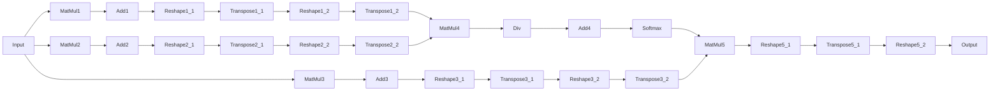

The attention mechanism is the core of Transformer-based models. Due to its computational demands, we often optimize it for high throughput and low inference times. This article explores different approaches to optimize attention mechanism through fusion in onnx graphs. Our focus is on BART and SWIN transformers.

## Background

Odds are that when working with Transformers, you come back to huggingface's Transformer package. Transformers uses *custom modelling code* for the attention layers (see e.g., [here](https://github.com/huggingface/transformers/blob/ebeec13609b537f9c760292354118c9d1d63f5a0/src/transformers/models/bart/modeling_bart.py#L147)). During export the PyTorch modelling code gets first translated into an [onnx-ir representation](https://github.com/microsoft/onnxscript/blob/main/onnxscript/function_libs/torch_lib/ops/__init__.py), optimized (optional), and then serialized as protobuf.[^1]

Like the transformers modelling code, the onnx graph will consist of low-level onnx primitives like `MatMul`, `Reshape` or `Concat` to model attention, even through more specialized [`ai.onnx.Attention`](https://onnx.ai/onnx/operators/onnx__Attention.html) ops are available in recent versions of onnx (>= opset 23) or from contributor ops [`com.microsoft.Attention`](https://github.com/microsoft/onnxruntime/blob/main/docs/ContribOperators.md#com.microsoft.Attention).


In the screenshot above, you can see a typical subgraph of the [scaled dot-product attention mechanism (SDPA)](<(https://arxiv.org/abs/1706.03762)>) from a BART encoder. On the left we find the projected value inputs, which get multiplied with the result of the query and key matrix in the centre. Quite a large subgraph for a common operation!🥵

## Core idea of attention fusion

The core idea is now to identify patterns in the onnx graph, that look like the attention mechanism and replace the entire subgraph with the `Attention` op plus required adaptions.

Fusing Attention is desirable for three reasons:

1. It's likely faster. When the onnx graph is executed on a gpu, the model is first loaded into high-bandwidth memory (HBM). Each operator is run as a small kernel (or program) on the gpu and launched into small but fast static RAM (SRAM) and then results are saved back to HBM. Memory transfers are typically slow, so we want to fuse multiple kernels or ops into larger kernels to minimize the number of memory transfers.[^2]
1. Hardware vendors often implement optimized implementations for ops for their onnx execution providers e.g., `CUDAExecutionProvider`, which will give you an additional performance edge.
1. Operator fusion will make your graphs tidier and satisfy your inner [Marie Kondō](https://knowyourmeme.com/photos/2247427-does-it-spark-joy).🤓

## Export onnx graph of BART encoder

Let's look at a good old bart encoder first. Despite being conceptually simple, it's an interesting example because it's a building block for more complex models like OpenAI's Whisper. We first prepare the model for export. I export via `torch` for ache of flexibility, while you could also use [optimum](https://huggingface.co/docs/optimum/index) if you favour higher level abstractions.

Let's first setup a venv and require all necessary dependencies:

```bash
uvx venv
source .venv
uv pip install torch onnx onnxscript==0.3.0 transformers==4.52.4
```

I strongly advice to pin at least the dependencies of `transformers` and `onnxscript` due to frequent changes in modelling or fusion.

```python {hl_lines="16-27 57"}
import os

import torch
from transformers import AutoModelForSeq2SeqLM, AutoTokenizer
from transformers.models.bart.modeling_bart import BartSdpaAttention

os.environ["TOKENIZERS_PARALLELISM"] = "false"

model_name = "hf-internal-testing/tiny-random-bart"
model = AutoModelForSeq2SeqLM.from_pretrained(model_name)
tokenizer = AutoTokenizer.from_pretrained(model_name)

model.eval()


class EncoderWrapper(torch.nn.Module):
    """A wrapper around the BART encoder for onnx export."""

    def __init__(self, encoder: torch.nn.Module):
        super().__init__()
        self.encoder = encoder

    def forward(
        self, input_ids: torch.Tensor, attention_mask: torch.Tensor | None = None
    ) -> torch.Tensor:
        outs = self.encoder(input_ids, attention_mask)
        return outs["last_hidden_state"]


model = EncoderWrapper(encoder=model.model.encoder)
print(model)

text = "God bless the internet."
inputs = tokenizer(text, return_tensors="pt")

input_ids, attention_mask = inputs["input_ids"], inputs["attention_mask"]

input_names = ["input_ids"]
output_names = ["encoder_output"]

onnx_path = "bart_model.onnx"

print(model)

torch.onnx.export(
    model,
    (input_ids,),
    onnx_path,
    export_params=True,
    input_names=input_names,
    output_names=output_names,
    dynamic_axes={
        "input_ids": {0: "batch_size", 1: "sequence_length"},
        "encoder_output": {0: "batch_size", 1: "sequence_length"},
    },
    opset_version=20,
    export_modules_as_functions={BartSdpaAttention},
)
```

Some aspects deserve more explanation (see highlight). We wrap the encoder as a class (`EncoderWrapper`) to only retrieve and rearrange inputs and outputs required for later processing. I export the scaled dot-product attention as an onnxscript function for easier fusion. This feature, however, has been deprecated in PyTorch and function-based rewrites have been removed from `onnxscript`.[^3]

## BART attention fusion with onnxruntime

Hands down, the most easiest way to perform attention fusion is via `onnxruntime`. Yet, it's also the most brittle. In a nutshell, `onnxruntime` tries to fuse attention by locating nodes like normalization layers subsequent to the attention mechanism in the onnx graph and from there pattern matches contiguous paths to parent nodes by their node type and position as a node input. If a suitable subgraph is found, the new attention nodes are added and unused nodes are subsequently removed.[^5]

This approach to attention fusion is prone to modelling changes or previous optimization passes that affect the onnx graph. [^4] Also, capabilities for matching against alternative paths or node attributes in onnxruntime are limited as we operate on directly on the protobuf. These limitations, ultimately led to the development of [`onnxscript`](https://github.com/microsoft/onnxscript), a powerful alternative, which we discuss below.

Speaking of brittle, for the following code to run with transformers (`transformers==4.52.4`), you'll require changes from [gh-24857](https://github.com/microsoft/onnxruntime/pull/24857) and unmerged fixes from [gh-25046](https://github.com/microsoft/onnxruntime/pull/25046).

```python {hl_lines="7-9"}
import onnxruntime as ort
from onnxruntime.transformers import optimizer
from onnxruntime.transformers.fusion_options import FusionOptions

m = optimizer.optimize_model(
    onnx_path,
    model_type="bart",
    num_heads=0,
    hidden_size=0,
    opt_level=2,
    use_gpu=False,
    verbose=True,
    only_onnxruntime=False,
)

optimized_path = "bart_encoder_optimized.onnx"
m.save_model_to_file(optimized_path)

print(f"Optimized ONNX model saved to {optimized_path}")
print(m.get_fused_operator_statistics())
```

Here, we set the model type to be `BART` to apply `BART`-specific fusions. Setting `num_heads=0` and `hidden_size=0` will auto-detect the number of attention heads and the hidden size from the graph (i.e., shape of query matrix). We get:

```
Please specify parameters of num_heads and hidden_size for model_type bart
Optimized ONNX model saved to bart_encoder_optimized.onnx
{'EmbedLayerNormalization': 1, 'Attention': 2, 'MultiHeadAttention': 0, 'Gelu': 0, 'FastGelu': 0, 'BiasGelu': 2, 'GemmFastGelu': 0, 'LayerNormalization': 0, 'SimplifiedLayerNormalization': 0, 'SkipLayerNormalization': 4, 'SkipSimplifiedLayerNormalization': 0, 'RotaryEmbedding': 0, 'QOrderedAttention': 0, 'QOrderedGelu': 0, 'QOrderedLayerNormalization': 0, 'QOrderedMatMul': 0}
```

Expectedly, attention fusion was performed for both attention layers aside from other fusions. If you'd like to perform specific optimizations only, you can provide a custom config `FusionOptions(...)`.

Next, we verify our newly created graph still yields the same outputs:

```python
sess = ort.InferenceSession(onnx_path, providers=["CPUExecutionProvider"])
encoder_outs_original = sess.run(["encoder_output"], {"input_ids": input_ids.numpy()})

sess_optimized = ort.InferenceSession(
    optimized_path, providers=["CPUExecutionProvider"]
)
encoder_outs_optimized = sess_optimized.run(
    ["encoder_output"], {"input_ids": input_ids.numpy()}
)

abs_diff = np.amax(np.abs(encoder_outs_original[0] - encoder_outs_optimized[0]))
print("abs difference:", abs_diff)
```

```
abs difference: 2.3841858e-07
```

That's reasonably close. :100:

## BART attention fusion with onnxscript

As discussed, `onnxruntime` is currently the most evolved solution to perform operator fusion. Let's now look at the new kid on the block, [`onnxscript`](https://github.com/microsoft/onnxscript). `onnxscript` is a way to naturally author onnx functions and models using a subset of python. Useful for our endeavour, it also includes an optimizer to optimize onnx models (do e.g., constant folding) and a rewriter to replace patterns in graph with replacement patterns. It comes with a large set of rewrite rules and we can even author our own rewrite rules.

To get started with the onnx rewriter, I found the [docs](https://microsoft.github.io/onnxscript/tutorial/rewriter/rewrite_patterns.html) to be immense help. We basically define a target pattern we want to match against, a replacement_pattern (i.e., the attention op) and some optional match condition. The match condition lets us perform additional checks for e.g., node attributes or input shapes, if the target pattern matches. We start by defining a custom rewrite rule with a target pattern in `pattern(...)` and a replacement pattern in `rewrite(...)`.

```python
import numpy as np
import onnxscript.ir as ir
import onnxscript.rewriter as rewriter
import onnxscript.rewriter.ort_fusions
from onnxscript.rewriter import pattern


class FuseBARTSDPARule(rewriter.pattern.RewriteRuleClassBase):
    def pattern(
        self,
        op,
        input,
        q_weight: ir.Value,
        k_weight: ir.Value,
        v_weight: ir.Value,
        q_bias: ir.Value,
        k_bias: ir.Value,
        v_bias: ir.Value,
    ):
        # query
        q = op.MatMul(input, q_weight)
        q_add = op.Add(q_bias, q)

        shape = op.Shape(input)
        gathered_shape = op.Gather(shape, op.Constant(), axis=0)
        q_unsqueezed_shape = op.Unsqueeze(gathered_shape, op.Constant())

        q_shape_concat = op.Concat(
            q_unsqueezed_shape,
            op.Constant(),
            op.Constant(),
            op.Constant(),
            axis=0,
        )
        q_reshaped = op.Reshape(
            q_add, q_shape_concat, allowzero=0, _outputs=["q_reshaped"]
        )

        q_transposed = op.Transpose(q_reshaped, perm=[0, 2, 1, 3])

        q_shape_transposed = op.Shape(q_transposed)
        q_t_slice_shape = op.Slice(
            q_shape_transposed,
            op.Constant(),
            op.Constant(),
        )
        q_dim = op.Cast(q_t_slice_shape, to=onnx.TensorProto.FLOAT)
        normalization_const = op.Constant()
        q_dim_divided = op.Div(normalization_const, op.Sqrt(q_dim))
        q_dim_sqrt = op.Sqrt(q_dim_divided)
        k_dim_sqrt = op.Sqrt(q_dim_divided)

        q_mul = op.Mul(q_transposed, q_dim_sqrt)

        # key
        k = op.MatMul(input, k_weight)
        k_add = op.Add(k_bias, k)

        unsqueeze_dim = op.Constant()
        k_unsqueezed_shape = op.Unsqueeze(gathered_shape, unsqueeze_dim)
        k_shape_concat = op.Concat(
            k_unsqueezed_shape,
            op.Constant(),
            op.Constant(),
            op.Constant(),
            axis=0,
        )
        k_reshaped = op.Reshape(k_add, k_shape_concat)
        k_transposed = op.Transpose(k_reshaped, perm=[0, 2, 3, 1])
        k_mul = op.Mul(k_transposed, k_dim_sqrt)

        attention_scores = op.MatMul(q_mul, k_mul)
        logits_softmax = op.Softmax(attention_scores, axis=-1)

        # values
        v = op.MatMul(input, v_weight)
        v_bias = op.Add(v_bias, v)
        v_unsqueezed_shape = op.Unsqueeze(gathered_shape, op.Constant())
        v_shape_concat = op.Concat(
            v_unsqueezed_shape,
            op.Constant(),
            op.Constant(),
            op.Constant(),
            axis=0,
        )
        v_reshaped = op.Reshape(v_bias, v_shape_concat)
        v_transposed = op.Transpose(v_reshaped, perm=[0, 2, 1, 3])

        sdpa = op.MatMul(logits_softmax, v_transposed)

        shape_unsqueeze = op.Unsqueeze(gathered_shape, op.Constant())
        shape_input = op.Shape(input)
        gather_shape_input = op.Gather(shape_input, op.Constant(), axis=0)
        gather_shape_unsqueeze = op.Unsqueeze(gather_shape_input, op.Constant())
        concat_shape_input = op.Concat(
            shape_unsqueeze, gather_shape_unsqueeze, op.Constant(), axis=0
        )
        sdpa_transposed = op.Transpose(sdpa, perm=[0, 2, 1, 3])
        sdpa_reshaped = op.Reshape(sdpa_transposed, concat_shape_input, allowzero=0)

        return sdpa_reshaped

    def rewrite(
        self,
        op,
        input: ir.Value,
        q_weight: ir.Value,
        k_weight: ir.Value,
        v_weight: ir.Value,
        q_bias: ir.Value,
        k_bias: ir.Value,
        v_bias: ir.Value,
        q_reshaped: ir.Value,
    ):
        num_heads = _ir_utils.get_dim(q_reshaped, 2)
        if not isinstance(num_heads, int):
            return None

        qkv_weight_packed = op.initializer(
            ir.tensor(
                np.concatenate(
                    [
                        q_weight.const_value.numpy(),
                        k_weight.const_value.numpy(),
                        v_weight.const_value.numpy(),
                    ],
                    axis=-1,
                )
            ),
            name="qkv_weight",
        )
        qkv_bias_packed = op.initializer(
            ir.tensor(
                np.concatenate(
                    [
                        q_bias.const_value.numpy(),
                        k_bias.const_value.numpy(),
                        v_bias.const_value.numpy(),
                    ],
                    axis=-1,
                )
            ),
            name="qkv_bias",
        )
        return op.Attention(
            input,
            qkv_weight_packed,
            qkv_bias_packed,
            None,
            num_heads=num_heads,
            _domain="com.microsoft",
        )
```

```
    # NOTE: similar to onnxruntime, we retrieve num_heads from q-reshape
    # https://github.com/KarelZe/onnxruntime/blob/0e52117520508e3b14d8272390449c29ac089647/onnxruntime/python/tools/transformers/fusion_attention.py#L165
```

TODO: What is going on here?

```
    # NOTE: This is custom op Attention!
    # https://github.com/microsoft/onnxruntime/blob/main/docs/ContribOperators.md#com.microsoft.Attention
    # see also:
    # https://github.com/microsoft/onnxscript/blob/51ecf47523ef079c53b0e620c62d56d70cfd3871/onnxscript/rewriter/ort_fusions/attention.py#L34
```

```python
onnx_model = ir.load(onnx_path)

rule = FuseBARTSDPARule.rule()
# Apply the rewrite rule to the model
tracer = pattern.MatchingTracer()
rule.apply_to_model(onnx_model, tracer=tracer, verbose=4)
tracer.report()
# Clean up and run shape inference. Note that you can use the Sequential pass to chain multiple passes together.
ir.passes.Sequential(
    onnxscript.rewriter.RewritePass([rule]),
    common_passes.RemoveUnusedNodesPass(),
    common_passes.ShapeInferencePass(),
)(onnx_model)

print(onnx_model)

ir.save(onnx_model, "bart_model_onnxscript_fused_new.onnx")
```

TODO: we retrieve head dimensions from the graph (q-reshape) similar to onnxruntime.

TODO: Maybe rename to BART self-attention fusion.

TODO: Explain that rule is written to match against optimized model with `optimizer.optimize(...)`. Verify this.

TODO: Rename variables in code similar to transformers.

## Fusion with standard rules in onnxscript

TODO: Maybe rename this section to SWIN?
TODO: explain what is special about SWIN self-attention? https://github.com/huggingface/transformers/blob/9487765f07ef4e5500d6ec21cad99aed4a037a3d/src/transformers/models/swin/modeling_swin.py#L439 Explain role of context layer. Explain of dropout in attention mechanism. How do we incorporate context layer in node assembly?

Now, let's consider a different model: the [SWIN encoder](https://arxiv.org/abs/2103.14030). The SWIN encoder is interesting, as no attention fusion has been implemented in `onnxruntime` and other approaches are required.

```python
import requests
import torch
from PIL import Image
from transformers import AutoImageProcessor, SwinModel
from transformers.models.swin.modeling_swin import SwinAttention

from onnxruntime.transformers import optimizer

model = SwinModel.from_pretrained("hf-internal-testing/tiny-random-SwinModel")
model.eval()

url = "http://images.cocodataset.org/val2017/000000039769.jpg"
image = Image.open(requests.get(url, stream=True).raw)

image_processor = AutoImageProcessor.from_pretrained(
    "hf-internal-testing/tiny-random-SwinModel"
)
inputs = image_processor(images=image, return_tensors="pt")

input_names = ["pixel_values"]
output_names = ["output"]

onnx_path = "swin_model.onnx"

# see:
# https://github.com/huggingface/transformers/blob/1094dd34f73dae1d9a91a6632635934516612490/src/transformers/models/swin/modeling_swin.py#L552
torch.onnx.export(
    model,
    (inputs["pixel_values"],),
    onnx_path,
    input_names=input_names,
    output_names=output_names,
    dynamic_axes={
        "pixel_values": {0: "batch_size", 1: "sequence_length"},
        "output": {0: "batch_size", 1: "sequence_length"},
    },
    opset_version=20,
    verbose=True,
    export_modules_as_functions={SwinAttention},
)
print(f"Model exported to {onnx_path}")
```

Now let's apply a set of `sdpa_rules` rules.

```python
import onnxscript
import onnxscript.ir as ir
import requests
import torch
from onnxscript.rewriter.ort_fusions.sdpa import sdpa_rules
from PIL import Image
from transformers import AutoImageProcessor, SwinModel
from transformers.models.swin.modeling_swin import SwinAttention

onnx_model = ir.load("/Users/markusbilz/Documents/git/onnxruntime/swin_model.onnx")
onnx_model = onnxscript.optimizer.optimize(onnx_model)

model_with_rewrite_applied = onnxscript.rewriter.rewrite(
    onnx_model, pattern_rewrite_rules=sdpa_rules
)
ir.save(model_with_rewrite_applied, "swin_model_with_attention_fusion.onnx")
```

## Fusion for SWIN

```python
class FuseSDPARule(pattern.RewriteRuleClassBase):
    def pattern(self, op, input, q_weight, k_weight, v_weight, q_bias, k_bias, v_bias):
        q = op.MatMul(input, q_weight)
        q_add = op.Add(q_bias, q)

        q_shape = op.Shape(q_add)

        q_dim_0_axis = op.Gather(q_shape, pattern.ANY_VALUE, axis=0)
        q_dim_0_shape = op.Unsqueeze(q_dim_0_axis, pattern.ANY_VALUE)

        q_dim_1_axis = op.Gather(q_shape, pattern.ANY_VALUE, axis=0)
        q_dim_1_shape = op.Unsqueeze(q_dim_1_axis, pattern.ANY_VALUE)

        q_shape_concat = op.Concat(
            q_dim_0_shape,
            q_dim_1_shape,
            pattern.ANY_VALUE,
            pattern.ANY_VALUE,
            axis=0,
        )
        q_reshaped = op.Reshape(
            q_add, q_shape_concat, allowzero=0, _outputs=["q_reshaped"]
        )
        q_transposed = op.Transpose(q_reshaped, perm=[0, 2, 1, 3])

        k = op.MatMul(input, k_weight)
        k_add = op.Add(k_bias, k)
        k_shape = op.Shape(k_add)
        k_dim_0_axis = op.Gather(k_shape, pattern.ANY_VALUE, axis=0)
        k_dim_0_shape = op.Unsqueeze(k_dim_0_axis, pattern.ANY_VALUE)

        k_dim_1_axis = op.Gather(k_shape, pattern.ANY_VALUE, axis=0)
        k_dim_1_shape = op.Unsqueeze(k_dim_1_axis, pattern.ANY_VALUE)

        # TODO: Figure out, why ANY_VALUE is needed here.?
        k_shape_concat = op.Concat(
            k_dim_0_shape,
            k_dim_1_shape,
            pattern.ANY_VALUE,
            pattern.ANY_VALUE,
            axis=0,
        )
        k_reshaped = op.Reshape(k_add, k_shape_concat, allowzero=0)
        k_transposed = op.Transpose(k_reshaped, perm=[0, 2, 3, 1])

        logits = op.MatMul(q_transposed, k_transposed)

        # sqrt_head_dim = math.sqrt(float(k_transposed.const_value.shape[-1]))
        # sqrt_head_dim = 2.828427 # math.sqrt(8.0)
        # op.Constant(value=make_tensor("true", TensorProto.BOOL, [1], [1])
        # normalization_constant = op.Constant(value=ir.tensor(sqrt_head_dim,dtype=ir.DataType.FLOAT))
        logits_div = op.Div(logits, pattern.ANY_VALUE)
        logits_add = op.Add(logits_div, pattern.ANY_VALUE)

        logits_softmax = op.Softmax(logits_add, axis=-1)

        v = op.MatMul(input, v_weight)
        v_add = op.Add(v_bias, v)
        v_dim_shape = op.Shape(v_add)
        v_dim_0_axis = op.Gather(v_dim_shape, pattern.ANY_VALUE, axis=0)
        v_dim_0_shape = op.Unsqueeze(v_dim_0_axis, pattern.ANY_VALUE)
        v_dim_1_axis = op.Gather(v_dim_shape, pattern.ANY_VALUE, axis=0)
        v_dim_1_shape = op.Unsqueeze(v_dim_1_axis, pattern.ANY_VALUE)

        v_shape_concat = op.Concat(
            v_dim_0_shape,
            v_dim_1_shape,
            pattern.ANY_VALUE,
            pattern.ANY_VALUE,
            axis=0,
        )
        v_reshaped = op.Reshape(v_add, v_shape_concat, allowzero=0)
        v_transposed = op.Transpose(v_reshaped, perm=[0, 2, 1, 3])

        sdpa = op.MatMul(logits_softmax, v_transposed)

        # relative position bias
        sdpa_transposed = op.Transpose(sdpa, perm=[0, 2, 1, 3])
        # sdpa_shape = op.Shape(sdpa_transposed)
        # FIXME: maybe introduce OrPattern here to match against unoptimized graph.
        sdpa_shape = op.Shape(sdpa_transposed)
        sdpa_dim_0_axis = op.Gather(sdpa_shape, pattern.ANY_VALUE, axis=0)
        sdpa_dim_0_shape = op.Unsqueeze(sdpa_dim_0_axis, pattern.ANY_VALUE)

        sdpa_dim_1_axis = op.Gather(sdpa_shape, pattern.ANY_VALUE, axis=0)
        sdpa_dim_1_shape = op.Unsqueeze(sdpa_dim_1_axis, pattern.ANY_VALUE)

        sdpa_dim_concat = op.Concat(
            sdpa_dim_0_shape,
            sdpa_dim_1_shape,
            pattern.ANY_VALUE,
            axis=0,
        )
        sdpa_reshaped = op.Reshape(sdpa_transposed, sdpa_dim_concat, allowzero=0)
        return sdpa_reshaped

        # return dense_add_bias

    def rewrite(
        self,
        op,
        input,
        q_weight,
        k_weight,
        v_weight,
        q_bias,
        k_bias,
        v_bias,
        q_reshaped,
    ):
        # Pack the weights and biases for Q, K, V
        qkv_weight_packed = op.initializer(
            ir.tensor(
                np.concatenate(
                    [
                        q_weight.const_value.numpy(),
                        k_weight.const_value.numpy(),
                        v_weight.const_value.numpy(),
                    ],
                    axis=-1,
                )
            ),
            name="qkv_weight",
        )
        qkv_bias_packed = op.initializer(
            ir.tensor(
                np.concatenate(
                    [
                        q_bias.const_value.numpy(),
                        k_bias.const_value.numpy(),
                        v_bias.const_value.numpy(),
                    ],
                    axis=-1,
                )
            ),
            name="qkv_bias",
        )
        num_heads = _ir_utils.get_dim(q_reshaped, 2)
        if not isinstance(num_heads, int):
            return None
        # NOTE: This is custom op Attention!
        # https://github.com/microsoft/onnxruntime/blob/main/docs/ContribOperators.md#com.microsoft.Attention
        # see also:
        # https://github.com/microsoft/onnxscript/blob/51ecf47523ef079c53b0e620c62d56d70cfd3871/onnxscript/rewriter/ort_fusions/attention.py#L34
        # FIXME: https://github.com/huggingface/transformers/blob/9487765f07ef4e5500d6ec21cad99aed4a037a3d/src/transformers/models/swin/modeling_swin.py#L439
        return op.Attention(
            input,
            qkv_weight_packed,
            qkv_bias_packed,
            None,
            num_heads=num_heads,
            _domain="com.microsoft",
        )
```

## Cross-attention with/without kv cache

To keep things simple, our focus till now, was only on SDPA. In practice, we will also have to deal with cross-attention, kv caches,....



## Performance results

```python
# TODO: add some solid timing code.
```

Stand up to the test

## Conclusion

Unfortunately, attention fusion is a very brittle process, which lead to the development of initiatives like `onnxscript`.

While researching for this blog post, I made several open-source contributions.

## References:

[^1]: see [https://github.com/justinchuby/diagrams/](https://github.com/justinchuby/diagrams/pull/1/files) for a helpful diagram on the internals of the PyTorch onnx exporter.

[^2]: see [talk on large language model inference with ONNX Runtime by Kunal Vaishnavi](https://youtu.be/jrIJT01E8Xw?feature=shared&t=420)

[^3]: see [pytorch docs](https://docs.pytorch.org/docs/stable/onnx_torchscript.html)

[^5]: see [fusion code in onnxruntime](https://github.com/microsoft/onnxruntime/blob/82c1bf9ce9dae02aa7ff19c91f4295c7aee8a9a0/onnxruntime/python/tools/transformers/fusion_bart_attention.py#L29)

[^4]: Modelling changes for attention happen more often than you'd think. See e.g., https://github.com/huggingface/transformers/commit/2c47618c1a282f925446506d53108dc6e82d9ef0
