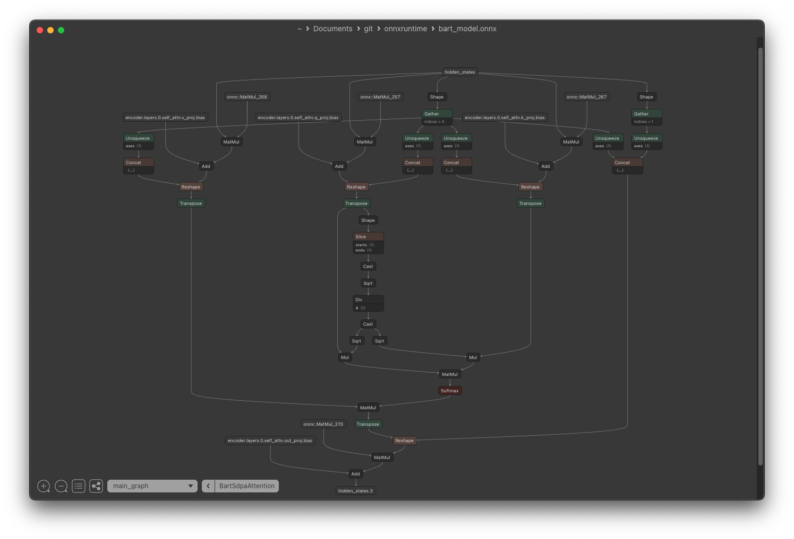
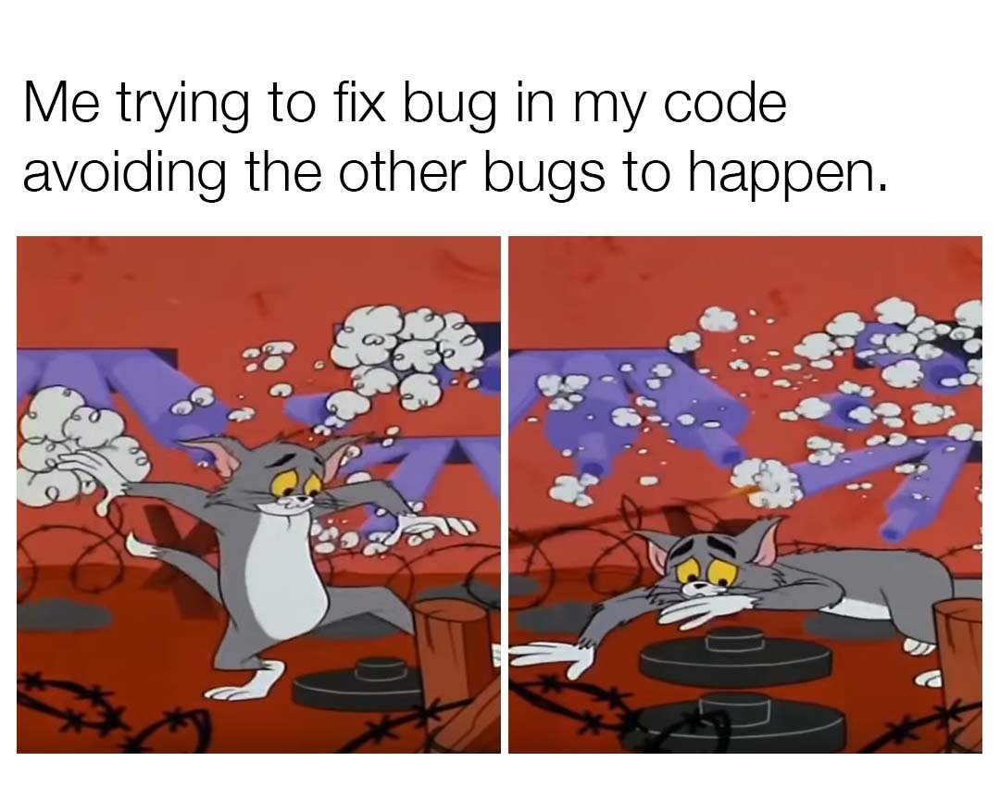
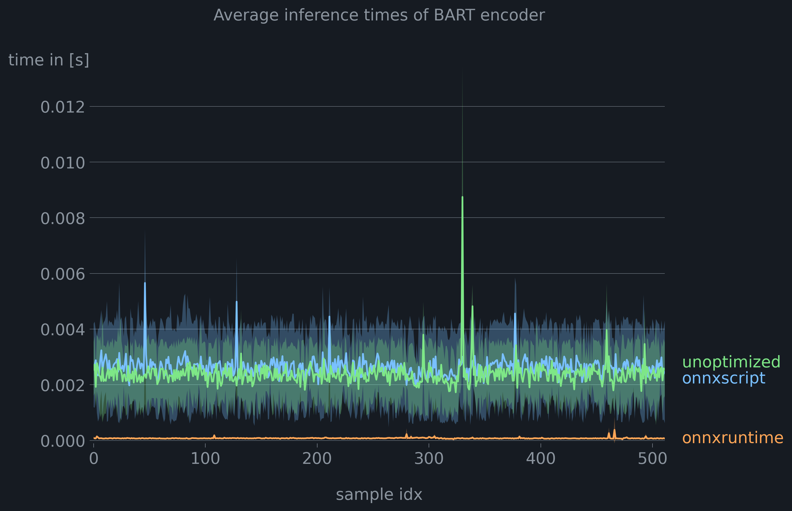
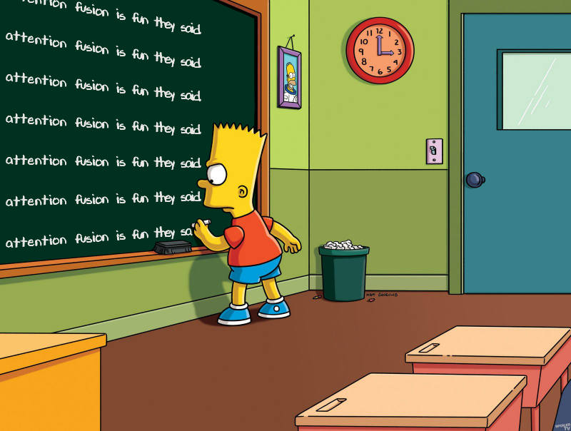

The attention mechanism is the core of Transformer-based models. Due to its computational demands, we often optimize it for high throughput and low inference times. This article explores different approaches to optimize attention mechanism through fusion in onnx graphs. Our focus is on BART transformers.

## Background

Odds are that when working with Transformers, you come back to huggingface's Transformer package. Transformers uses *custom modelling code* for the attention layers (see e.g., [here](https://github.com/huggingface/transformers/blob/ebeec13609b537f9c760292354118c9d1d63f5a0/src/transformers/models/bart/modeling_bart.py#L147)). During export the PyTorch modelling code gets first translated into an [onnx-ir representation](https://github.com/microsoft/onnxscript/blob/main/onnxscript/function_libs/torch_lib/ops/__init__.py), optimized (optional), and then serialized as protobuf.[^1]

Like the transformers modelling code, the onnx graph will consist of low-level onnx primitives like `MatMul`, `Reshape` or `Concat` to model attention, even through more specialized [`ai.onnx.Attention`](https://onnx.ai/onnx/operators/onnx__Attention.html) ops are available in recent versions of onnx (>= opset 23 🆕) or from contributor ops [`com.microsoft.Attention`](https://github.com/microsoft/onnxruntime/blob/main/docs/ContribOperators.md#com.microsoft.Attention).



In the screenshot from Netron above, you can see a typical subgraph of the [scaled dot-product attention mechanism (SDPA)](<(https://arxiv.org/abs/1706.03762)>) from a BART encoder. On the left we find the projected value inputs, which get multiplied with the result of the query and key matrix in the centre. Quite a large subgraph for a common operation!🥵

## Core idea of attention fusion

The core idea is now to identify patterns in the onnx graph, that look like the attention mechanism and replace the entire subgraph with the `Attention` op plus required adaptions.

Fusing Attention is desirable for three reasons:

1. It's likely faster. When the onnx graph is executed on a gpu, the model is first loaded into high-bandwidth memory (HBM). Each operator is run as a small kernel (or program) on the gpu and launched into small but fast static RAM (SRAM) and then results are saved back to HBM. Memory transfers are typically slow, so we want to fuse multiple kernels or ops into larger kernels to minimize the number of memory transfers.[^2]
1. Hardware vendors often implement optimized implementations for ops for their onnx execution providers e.g., `CUDAExecutionProvider`, which will give you an additional performance edge.
1. Operator fusion will make your graphs tidier and satisfy your inner [Marie Kondō](https://knowyourmeme.com/photos/2247427-does-it-spark-joy).🤓

## BART encoder

### Export ONNX graph of BART encoder

Let's look at a good old bart encoder first. Despite being conceptually simple, it's an interesting example because it's a building block for more complex models like OpenAI's Whisper. We first prepare the model for export. I export via `torch` for ache of flexibility, while you could also use [optimum](https://huggingface.co/docs/optimum/index) if you favour higher level abstractions.

Let's first setup a venv and require all necessary dependencies:

```bash
uvx venv
source .venv
uv pip install torch onnx git+https://github.com/microsoft/onnxscript.git@main transformers==4.52.4
```

I strongly advice to pin at least the dependencies of `transformers` due to modelling changes in modelling and install `onnxscript` from source due to the frequency of changes.

```python {hl_lines="16-27 57"}
import os

import torch
from transformers import AutoModelForSeq2SeqLM, AutoTokenizer
from transformers.models.bart.modeling_bart import BartSdpaAttention

os.environ["TOKENIZERS_PARALLELISM"] = "false"

model_name = "hf-internal-testing/tiny-random-bart"
model = AutoModelForSeq2SeqLM.from_pretrained(model_name)
tokenizer = AutoTokenizer.from_pretrained(model_name)

model.eval()


class EncoderWrapper(torch.nn.Module):
    """A wrapper around the BART encoder for onnx export."""

    def __init__(self, encoder: torch.nn.Module):
        super().__init__()
        self.encoder = encoder

    def forward(
        self, input_ids: torch.Tensor, attention_mask: torch.Tensor | None = None
    ) -> torch.Tensor:
        outs = self.encoder(input_ids, attention_mask)
        return outs["last_hidden_state"]


model = EncoderWrapper(encoder=model.model.encoder)
print(model)

text = "God bless the internet."
inputs = tokenizer(text, return_tensors="pt")

input_ids, attention_mask = inputs["input_ids"], inputs["attention_mask"]

input_names = ["input_ids"]
output_names = ["encoder_output"]

onnx_path = "bart_model.onnx"

print(model)

torch.onnx.export(
    model,
    (input_ids,),
    onnx_path,
    export_params=True,
    input_names=input_names,
    output_names=output_names,
    dynamic_axes={
        "input_ids": {0: "batch_size", 1: "sequence_length"},
        "encoder_output": {0: "batch_size", 1: "sequence_length"},
    },
    opset_version=20,
    export_modules_as_functions={BartSdpaAttention},
)
```

Some aspects deserve more explanation (see highlight). We wrap the encoder as a class (`EncoderWrapper`) to only retrieve and rearrange inputs and outputs required for later processing. This feature, however, has been deprecated in PyTorch and function-based rewrites have been removed from `onnxscript`. ~~I export the scaled dot-product attention as an onnxscript function for easier fusion.~~ [^3]

### Attention fusion with onnxruntime for BART encoder

Hands down, the most easiest way to perform attention fusion is via `onnxruntime`. Yet, it's also the most brittle. In a nutshell, `onnxruntime` tries to fuse attention by locating nodes like normalization layers subsequent to the attention mechanism in the onnx graph and from there pattern matches contiguous paths to parent nodes by their node type and position as a node input. If a suitable subgraph is found, the new attention nodes are added and unused nodes are subsequently removed.[^5]

This approach to attention fusion is prone to modelling changes or previous optimization passes that affect the onnx graph.[^4] Also, capabilities for matching against alternative paths, commuted inputs or node attributes in onnxruntime are limited and we operate on directly on the protobuf. These limitations, ultimately led to the development of [`onnxscript`](https://github.com/microsoft/onnxscript), which we discuss below.



Speaking of brittle, for the following code to run with transformers (`transformers==4.52.4`), you'll require changes from [onnxruntime/gh-24857](https://github.com/microsoft/onnxruntime/pull/24857) and my unmerged fixes from [onnxruntime/gh-25046](https://github.com/microsoft/onnxruntime/pull/25046).

```python {hl_lines="7-9"}
import onnxruntime as ort
from onnxruntime.transformers import optimizer
from onnxruntime.transformers.fusion_options import FusionOptions

m = optimizer.optimize_model(
    onnx_path,
    model_type="bart",
    num_heads=0,
    hidden_size=0,
    opt_level=2,
    use_gpu=False,
    verbose=True,
    only_onnxruntime=False,
)

optimized_path = "bart_encoder_optimized.onnx"
m.save_model_to_file(optimized_path)

print(f"Optimized ONNX model saved to {optimized_path}")
print(m.get_fused_operator_statistics())
```

Here, we set the model type to be `BART` to apply `BART`-specific fusions. Setting `num_heads=0` and `hidden_size=0` will auto-detect the number of attention heads and the hidden size from the graph (i.e., shape of query matrix). We get:

```
Please specify parameters of num_heads and hidden_size for model_type bart
Optimized ONNX model saved to bart_encoder_optimized.onnx
{'EmbedLayerNormalization': 1, 'Attention': 2, 'MultiHeadAttention': 0, 'Gelu': 0, 'FastGelu': 0, 'BiasGelu': 2, 'GemmFastGelu': 0, 'LayerNormalization': 0, 'SimplifiedLayerNormalization': 0, 'SkipLayerNormalization': 4, 'SkipSimplifiedLayerNormalization': 0, 'RotaryEmbedding': 0, 'QOrderedAttention': 0, 'QOrderedGelu': 0, 'QOrderedLayerNormalization': 0, 'QOrderedMatMul': 0}
```

Expectedly, attention fusion was performed for both attention layers aside from other fusions. If you'd like to perform specific optimizations only, you can provide a custom config `FusionOptions(...)`.

Next, we verify our newly created graph still yields the same outputs:

```python
sess = ort.InferenceSession("bart_model.onnx", providers=["CPUExecutionProvider"])
encoder_outs_original = sess.run(["encoder_output"], {"input_ids": input_ids.numpy()})

sess_optimized = ort.InferenceSession(
    optimized_path, providers=["CPUExecutionProvider"]
)
encoder_outs_optimized = sess_optimized.run(
    ["encoder_output"], {"input_ids": input_ids.numpy()}
)

abs_diff = np.amax(np.abs(encoder_outs_original[0] - encoder_outs_optimized[0]))
print("abs difference:", abs_diff)
```

```
abs difference: 2.3841858e-07
```

That's reasonably close. :100:

### Attention fusion with onnxscript for BART encoder

As discussed, `onnxruntime` is currently the most complete solution to perform operator fusion. Let's now turn to the new kid on the block, [`onnxscript`](https://github.com/microsoft/onnxscript).

> "`onnxscript` is a way to naturally author onnx functions and models using a subset of python."

Useful for our endeavour, it also features an optimizer to optimize onnx models (do e.g., constant folding) and a capable rewriter to replace patterns in graph with replacement patterns. We can even author our own rewrite rules (or contribute a fix).

#### Default rewrites in onnxscript

Similar to `optimizer.optimize_model(...)`, `onnxscript` comes `rt_fusions.optimize_for_ort(...)` with a simple utility to apply `onnxruntime`-specific and transformer-specific fusions. This should be your goto solution.

Attention fusion in `onnxscript` follows a divide and conquer approach. First, the model is loaded as an [`ir.Model`](https://onnx.ai/ir-py/api/generated/onnx_ir.Model.html#) and then rewrite patterns are applied sequentially. Attention ops are first combined into a *temporary* `SDPA` node, which is subsequently fused into a [`MultiheadAttention`](https://github.com/microsoft/onnxruntime/blob/main/docs/ContribOperators.md#com.microsoft.MultiHeadAttention) node and eventually into an [`Attention`](https://github.com/microsoft/onnxruntime/blob/main/docs/ContribOperators.md#com.microsoft.Attention) node.[^7] It's important to understand, that `SDPA` is no valid op and you won't it find in the specs. It's merely a placeholder with standardized inputs/node for subsequent fusions. Let's give it a try.

```python
import onnxscript.ir as ir
from onnxscript.rewriter.ort_fusions import optimize_for_ort

onnx_model = ir.load("bart_encoder.onnx")
optimized_model, stats = optimize_for_ort(onnx_model, debug=True)
print(stats)
```

From the stats, we can tell, if attention fusion was successfully applied. Watch out for `sdpa`, `gqa` (grouped-query-attention) and `mha1`, `mha2`, and `mha_bias` (multi-head-attention), and `attention`.

```
{'erf_gelu': 0, 'rms_normalization': 0, 'skip_layer_normalization': 4, 'skip_rms_normalization': 0, 'rotary_embedding': 0, 'partial_rotary_embedding': 0, 'cos_sin_cache': 0, 'sdpa': 0, 'gqa': 0, 'packed_qkv_for_gqa': 0, 'mha1': 0, 'mha2': 0, 'mha_bias': 0, 'attention': 0, 'gelu': 0, 'bias_gelu': 2}
```

For BART `onnxscript` failed to perform attention rewrites. By setting the `debug=True`, we get additional infos, why fusion failed. In our case, a shape constraint of the output projection in the attention mechanism, was not met and and hence no rewrite applied.

```
...
Rule: SDPA
--------------------------------------------------------------------------------
Status: CONDITION_FAILED
Graph matching failed due to failing check condition : Dimension 2 of %"/encoder/layers.0/self_attn/Transpose_1_output_0"<FLOAT,[unk__4,4,unk__8,4]> (unk__8) does not have expected size (unk__7).
Failure at or around nodes/values:
%"/encoder/layers.0/self_attn/Transpose_1_output_0"<FLOAT,>
Matched nodes:
Node: '/encoder/layers.0/self_attn/Transpose_2'
%"/encoder/layers.0/self_attn/Transpose_2_output_0"<FLOAT,> ⬅️ ::Transpose(%"/encoder/layers.0/self_attn/Reshape_1_output_0") {perm=[0, 2,
3, 1]}
Node: '/encoder/layers.0/self_attn/Mul'
%"/encoder/layers.0/self_attn/Mul_output_0"<FLOAT,> ⬅️ ::Mul(%"/encoder/layers.0/self_attn/Transpose_output_0",
%"/encoder/layers.0/self_attn/Sqrt_1_output_0")
Node: '/encoder/layers.0/self_attn/Mul_1'
%"/encoder/layers.0/self_attn/Mul_1_output_0"<FLOAT,> ⬅️ ::Mul(%"/encoder/layers.0/self_attn/Transpose_2_output_0",
%"/encoder/layers.0/self_attn/Sqrt_1_output_0")
Node: '/encoder/layers.0/self_attn/MatMul'
%"/encoder/layers.0/self_attn/MatMul_output_0"<FLOAT,> ⬅️ ::MatMul(%"/encoder/layers.0/self_attn/Mul_output_0",
%"/encoder/layers.0/self_attn/Mul_1_output_0")
Node: '/encoder/layers.0/self_attn/Softmax'
%"/encoder/layers.0/self_attn/Softmax_output_0"<FLOAT,> ⬅️ ::Softmax(%"/encoder/layers.0/self_attn/MatMul_output_0") {axis=-1}
Node: '/encoder/layers.0/self_attn/MatMul_1'
%"/encoder/layers.0/self_attn/MatMul_1_output_0"<FLOAT,> ⬅️ ::MatMul(%"/encoder/layers.0/self_attn/Softmax_output_0",
%"/encoder/layers.0/self_attn/Transpose_1_output_0")
--------------------------------------------------------------------------------
```

In my tests, I found operator fusion using `optimize_for_ort(...)` to be a russian roulette. As `onnxscript` is a quite young project and the variety of models is gigantic, not all patterns/variants may work out of the bat. Still, it's an promising effort and great place to start. If the default rules fail, we can write our custom rewrite rules.

#### Custom rewrites in onnxscript

To get started with the onnx rewriter, I found the [docs](https://microsoft.github.io/onnxscript/tutorial/rewriter/rewrite_patterns.html) and studying existing rules to be an immense help. We basically define a target pattern to match against, a replacement_pattern (i.e., the attention op) and some optional match condition. The match condition lets us perform additional checks for e.g., input shapes, if the target pattern matches. We start by defining a custom rewrite rule with a target pattern in `pattern(...)` and a replacement pattern in `rewrite(...)`.

```python {hl_lines="35-37 50-51 116-118 146-153"}
import numpy as np
import onnxscript.ir as ir
import onnxscript.rewriter as rewriter
import onnxscript.rewriter.ort_fusions
from onnxscript.rewriter import _ir_utils, common_passes, pattern


class FuseBARTSDPARule(rewriter.pattern.RewriteRuleClassBase):
    def pattern(
        self,
        op,
        input,
        q_weight: ir.Value,
        k_weight: ir.Value,
        v_weight: ir.Value,
        q_bias: ir.Value,
        k_bias: ir.Value,
        v_bias: ir.Value,
    ):
        # query
        q = op.MatMul(input, q_weight)
        q_add = op.Add(q_bias, q)

        shape = op.Shape(input)
        gathered_shape = op.Gather(shape, op.Constant(), axis=0)
        q_unsqueezed_shape = op.Unsqueeze(gathered_shape, op.Constant())

        q_shape_concat = op.Concat(
            q_unsqueezed_shape,
            op.Constant(),
            op.Constant(),
            op.Constant(),
            axis=0,
            _outputs=["q_shape"],
        )
        q_reshaped = op.Reshape(q_add, q_shape_concat, allowzero=0)

        q_transposed = op.Transpose(q_reshaped, perm=[0, 2, 1, 3])

        q_shape_transposed = op.Shape(q_transposed)
        q_t_slice_shape = op.Slice(
            q_shape_transposed,
            op.Constant(),
            op.Constant(),
        )
        q_dim = op.Cast(q_t_slice_shape, to=onnx.TensorProto.FLOAT)
        normalization_const = op.Constant()
        q_dim_divided = op.Div(normalization_const, op.Sqrt(q_dim))
        q_dim_sqrt = op.Sqrt(q_dim_divided)
        k_dim_sqrt = op.Sqrt(q_dim_divided)

        q_mul = op.Mul(q_transposed, q_dim_sqrt)

        # key
        k = op.MatMul(input, k_weight)
        k_add = op.Add(k_bias, k)

        unsqueeze_dim = op.Constant()
        k_unsqueezed_shape = op.Unsqueeze(gathered_shape, unsqueeze_dim)
        k_shape_concat = op.Concat(
            k_unsqueezed_shape,
            op.Constant(),
            op.Constant(),
            op.Constant(),
            axis=0,
        )
        k_reshaped = op.Reshape(k_add, k_shape_concat)
        k_transposed = op.Transpose(k_reshaped, perm=[0, 2, 3, 1])
        k_mul = op.Mul(k_transposed, k_dim_sqrt)

        attention_scores = op.MatMul(q_mul, k_mul)
        logits_softmax = op.Softmax(attention_scores, axis=-1)

        # values
        v = op.MatMul(input, v_weight)
        v_bias = op.Add(v_bias, v)
        v_unsqueezed_shape = op.Unsqueeze(gathered_shape, op.Constant())
        v_shape_concat = op.Concat(
            v_unsqueezed_shape,
            op.Constant(),
            op.Constant(),
            op.Constant(),
            axis=0,
        )
        v_reshaped = op.Reshape(v_bias, v_shape_concat)
        v_transposed = op.Transpose(v_reshaped, perm=[0, 2, 1, 3])

        sdpa = op.MatMul(logits_softmax, v_transposed)

        # out projection
        shape_unsqueeze = op.Unsqueeze(gathered_shape, op.Constant())
        shape_input = op.Shape(input)
        gather_shape_input = op.Gather(shape_input, op.Constant(), axis=0)
        gather_shape_unsqueeze = op.Unsqueeze(gather_shape_input, op.Constant())
        concat_shape_input = op.Concat(
            shape_unsqueeze, gather_shape_unsqueeze, op.Constant(), axis=0
        )
        sdpa_transposed = op.Transpose(sdpa, perm=[0, 2, 1, 3])
        sdpa_reshaped = op.Reshape(sdpa_transposed, concat_shape_input, allowzero=0)

        return sdpa_reshaped

    def rewrite(
        self,
        op,
        input: ir.Value,
        q_weight: ir.Value,
        k_weight: ir.Value,
        v_weight: ir.Value,
        q_bias: ir.Value,
        k_bias: ir.Value,
        v_bias: ir.Value,
        q_shape: ir.Value,
    ):
        num_heads = _ir_utils.get_singleton_value(q_shape.producer().inputs[-2])
        if not isinstance(num_heads, int):
            return None

        qkv_weight_packed = op.initializer(
            ir.tensor(
                np.concatenate(
                    [
                        q_weight.const_value.numpy(),
                        k_weight.const_value.numpy(),
                        v_weight.const_value.numpy(),
                    ],
                    axis=-1,
                )
            ),
            name="qkv_weight",
        )
        qkv_bias_packed = op.initializer(
            ir.tensor(
                np.concatenate(
                    [
                        q_bias.const_value.numpy(),
                        k_bias.const_value.numpy(),
                        v_bias.const_value.numpy(),
                    ],
                    axis=-1,
                )
            ),
            name="qkv_bias",
        )
        return op.Attention(
            input,
            qkv_weight_packed,
            qkv_bias_packed,
            None,
            num_heads=num_heads,
            _domain="com.microsoft",
        )
```

There is a lot going on, so let's focus on the highlights. First, we we are storing the shape of the reshaped query matrix in a variable `q_shape` in `pattern(...)`. Similar to `onnxruntime` we can thereby auto-detect the number of attention heads based on the shape of the tensor. In a similar vain, we fallback to inputs from the concat, as e.g., `get_dim(...)` on `op.Reshape(...)` would give dynamic shapes [^6]

Other than in the original transformer paper, the query and key transpose are scaled separately by `1/sqrt(dim_k)` *before* the `MatMul`. This is commonly done for numerical stability and prevents values from blowing up, if dims of query and key are large.[^7]

We rewrite to [`Attention`](https://github.com/microsoft/onnxruntime/blob/main/docs/ContribOperators.md#com.microsoft.Attention) node from contributor ops (see `_domain="com.microsoft"`). In order to meet the input shape requirements of the attention node, we first pack the weights and bias terms for efficiency.

Let's now apply now put everything to a test:

```python
onnx_model = ir.load("bart_model.onnx")

rule = FuseBARTSDPARule.rule()

onnx_model = onnxscript.optimizer.optimize(onnx_model)

ir.passes.Sequential(
    onnxscript.rewriter.RewritePass([rule]),
    common_passes.RemoveUnusedNodesPass(),
    common_passes.ShapeInferencePass(),
)(onnx_model)

ir.save(onnx_model, "bart_model_onnxscript_fused.onnx")
```

We first apply the `optimizer` and then apply our custom rewrite pass, followed by a final clean up and shape inference to determine/check input/output shapes from [`ir-py`](https://onnx.ai/ir-py/api/ir_passes_common.html#onnx_ir.passes.common.ShapeInferencePass). Here, `Sequential(...)` is used to chain together multiple passes.

Again, run:

```python
sess = ort.InferenceSession(onnx_path, providers=["CPUExecutionProvider"])
encoder_outs_original = sess.run(["encoder_output"], {"input_ids": input_ids.numpy()})

sess_optimized = ort.InferenceSession(
    optimized_path, providers=["CPUExecutionProvider"]
)
encoder_outs_optimized = sess_optimized.run(
    ["encoder_output"], {"input_ids": input_ids.numpy()}
)

abs_diff = np.amax(np.abs(encoder_outs_original[0] - encoder_outs_optimized[0]))
print("abs difference:", abs_diff)
```

```
abs difference: 2.3841858e-07
```

Outputs are identical to our unoptimized model. :100: `onnxscript` has the advantage of defining a pythonic api to rewrite graphs, which makes graph rewrites a chime. Admittedly, our current solution suffers from some of the problems we have seen with `onnxruntime`. Specifically, we do not account for slight variations in the graph layout. We'll address this issue in the next example.

### Performance results for BART encoder

I wrote a simple [benchmarking script](https://gist.github.com/KarelZe/2b689ad0f2182b64570e7e5d32a36a07) to measure the performance impact of attention fusion. We compare the unoptimized onnx graph, the graph with fused attention from onnxscript, and the graph from onnxscript incl. other fused ops (i.e., [`SkipLayerNormalization`](https://github.com/microsoft/onnxruntime/blob/rel-1.20.0/docs/ContribOperators.md#commicrosoftskiplayernormalization), [`BiasGelu`](https://github.com/microsoft/onnxruntime/blob/rel-1.20.0/docs/ContribOperators.md#com.microsoft.BiasGelu) etc.).

#### Setup

- model `hf-internal-testing/tiny-random-bart`
- measured on Mac Mini with Apple M2 Pro with `CoreMLExecutionProvider`
- 512 samples from the [cola dataset](https://huggingface.co/datasets/nyu-mll/glue/viewer/cola?views%5B%5D=cola_train)
- 5 repeats per sample + 1 warmup step

#### Results



We obtain a [speedup](https://en.wikipedia.org/wiki/Speedup) of approx. ×2.4. If we also enable other operator fusions, as in the onnxruntime case, we see speedups up to ×30. Admittedly, the overall inference time is negatable for all our models.

## BART decoder

So far, we skipped all the good stuff and only a looked at self-attention. This example will look into cross-attention + kv cache.

## Fusing to Attention op from the `onnx.ai` domain

Since opset 23 [`Attention`](https://onnx.ai/onnx/operators/onnx__Attention.html) is available `onnx`. If you are advanterous and want fuse to this op instead, you can do:

```python
def rewrite(self, op, query: ir.Value, key: ir.Value, value: ir.Value) -> ir.Value:
    return op.Attention(query, key, value, _outputs=1, _version=23, _domain="ai.onnx")
```

Be sure to adjust your code for the different inputs and set `_version=23`. The domain defaults to `_domain="ai.onnx"` anyway.You may need to [convert your input model](https://onnx.ai/onnx/api/version_converter.html) to opset 23 first, using:

```python
import onnx
from onnx.version_converter import convert_version

onnx_model_lower_opset = onnx.load("bart_encoder.onnx")
onnx_model = ir.from_proto(convert_version(onnx_model_lower_opset, 23))
```

Be aware that the official versions of `onnxruntime` only ship with support opset `<=22`.

## Conclusion

worked on other attention fusions for `SWIN`,

Unfortunately, attention fusion is a very brittle process, which lead to the development of initiatives like `onnxscript`. `onnxscript` simplifies the process of attention fusion greatly.

onnxscript does a much better job of , variadic inputs, commuted inputs

Long fusion times, explosion of patterns.

Ongoing efforts for E-graphs

To keep things simple, our focus till now, was only on SDPA. In practice, we will also have to deal with cross-attention, kv caches,....

I found myself, contributing several fixes and test models (see below).

Attention is no free lunch multi-head-attenion didn't bing immediate improvements in tests



## Contributions 🤝

While researching for this blog post, I contributed some fixes, which posed a great learning opportunity:

1. added support to `BiasGeluFusion` to fuse Gelu from onnx domain and shape validation (see [onnxscript/gh-2364](https://github.com/microsoft/onnxscript/pull/2364/) + [onnxscript/gh-2393](https://github.com/microsoft/onnxscript/pull/2393/))
1. fixed `SkipLayerNormFusion` in onnxscript for default attributes and handle reversed inputs (see [onnxscript/gh-2396](https://github.com/microsoft/onnxscript/issues/2378))
1. fixed attention fusion for BART with keys and bias term (see [onnxruntime/gh-25046](https://github.com/microsoft/onnxruntime/pull/25046))
1. fixed pre-fixing of graphs in onnx compose, when `rename_inputs=False/rename_outputs=False`(see [onnx/gh-6994](https://github.com/onnx/onnx/pull/6994))
1. improved docs for function-based rewrites in onnxscript (see [onnscript/gh-2359](https://github.com/microsoft/onnxscript/pull/2359))

## References

[^1]: see [https://github.com/justinchuby/diagrams/](https://github.com/justinchuby/diagrams/pull/1/files) for a helpful diagram on the internals of the PyTorch ONNX exporter.

[^2]: see [talk on large language model inference with ONNX Runtime by Kunal Vaishnavi](https://youtu.be/jrIJT01E8Xw?feature=shared&t=420)

[^3]: This feature has been deprecated in PyTorch and function-based rewrites have been removed from `onnxscript`, see [pytorch docs](https://docs.pytorch.org/docs/stable/onnx_torchscript.html)

[^5]: see [fusion code in onnxruntime](https://github.com/microsoft/onnxruntime/blob/82c1bf9ce9dae02aa7ff19c91f4295c7aee8a9a0/onnxruntime/python/tools/transformers/fusion_bart_attention.py#L29)

[^4]: Modelling changes for attention happen more often than you'd think. See e.g., https://github.com/huggingface/transformers/commit/2c47618c1a282f925446506d53108dc6e82d9ef0

[^7]: see [Megatron-DeepSpeed/gh-118](https://github.com/bigscience-workshop/Megatron-DeepSpeed/pull/118)

[^6]: see [onnxruntime implementation](https://github.com/microsoft/onnxruntime/blob/0e52117520508e3b14d8272390449c29ac089647/onnxruntime/python/tools/transformers/fusion_attention.py#L165)
