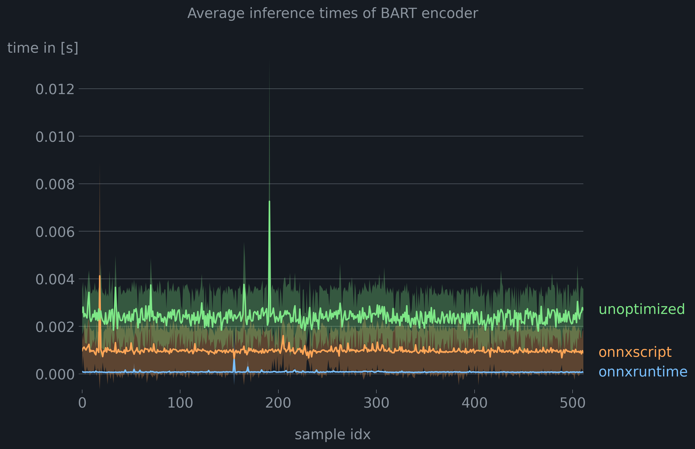

The attention mechanism is the core of Transformer-based models. Due to its computational demands, we often want to optimize it for high throughput and low inference times. This article explores different approaches to optimize attention mechanism through fusion in ONNX graphs. Our focus is on BART transformers.

## Background

Odds are that when working with Transformers, you come back to huggingface's Transformer package. Transformers utilizes *custom modeling code* for attention layers (see, e.g., [here](https://github.com/huggingface/transformers/blob/ebeec13609b537f9c760292354118c9d1d63f5a0/src/transformers/models/bart/modeling_bart.py#L147)). During export, the PyTorch modeling code is first translated into an [ONNX-IR representation](https://github.com/microsoft/onnxscript/blob/main/onnxscript/function_libs/torch_lib/ops/__init__.py), optionally optimized, and then serialized as a protobuf.[^1]

Similar to the Transformers modeling code, the ONNX graph typically consists of low-level ONNX primitives such as `MatMul`, `Reshape`, and `Concat` to model attention. Yet, more specialized [`ai.onnx.Attention`](https://onnx.ai/onnx/operators/onnx__Attention.html) ops are available in recent versions of onnx (>= opset 23 🆕) or from contributor ops [`com.microsoft.Attention`](https://github.com/microsoft/onnxruntime/blob/main/docs/ContribOperators.md#com.microsoft.Attention).


The screenshot from Netron illustrates a typical subgraph of the [Scaled Dot-Product Attention mechanism (SDPA)](<(https://arxiv.org/abs/1706.03762)>) from a BART encoder. The projected value inputs are on the left, multiplied by the result of the query and key matrices in the center. Quite a large subgraph for a common operation! 🥵

## Core Idea of Attention Fusion

The fundamental concept behind attention fusion is to identify patterns within the ONNX graph that resemble the attention mechanism and replace these subgraphs with the `Attention` operator, along with any necessary adjustments.

Fusing Attention is beneficial for three primary reasons:

1. **Improved Performance:** Executing the ONNX graph on a GPU involves loading the model into high-bandwidth memory (HBM). Each operator is run as a small kernel (or program) on the gpu and launched into small but fast static RAM (SRAM) and then results are saved back to HBM. Memory transfers are typically slow, so we want to fuse multiple kernels or ops into larger kernels to minimize the number of memory transfers.[^2]
1. **Hardware Optimization:** Hardware vendors often provide optimized implementations for operators within their ONNX execution providers (e.g., `CUDAExecutionProvider`), resulting in additional performance gains.
1. **Simpler Graphs:** Operator fusion simplifies your graphs, appealing to your inner [Marie Kondō](https://knowyourmeme.com/photos/2247427-does-it-spark-joy). 🤓

## BART Encoder

### Exporting the ONNX Graph of a BART Encoder

Let's look at a good old bart encoder first. Despite its conceptual simplicity, it serves as an excellent example because it forms the basis for more complex models like OpenAI's Whisper. We'll begin by preparing the model for export. I use `torch` for export to ache of flexibility, though you could also opt for [Optimum](https://huggingface.co/docs/optimum/index) if you prefer higher-level abstractions.

First, let's set up a virtual environment and install the required dependencies:

```bash
uvx venv
source .venv
uv pip install torch onnx git+https://github.com/microsoft/onnxscript.git@main transformers==4.52.4
```

I strongly advice to pin at least the dependencies of `transformers` due to modelling changes in modelling and install `onnxscript` from source due to the frequency of changes.

```python {hl_lines="16-27 57"}
import os

import torch
from transformers import AutoModelForSeq2SeqLM, AutoTokenizer
from transformers.models.bart.modeling_bart import BartSdpaAttention

os.environ["TOKENIZERS_PARALLELISM"] = "false"

model_name = "hf-internal-testing/tiny-random-bart"
model = AutoModelForSeq2SeqLM.from_pretrained(model_name)
tokenizer = AutoTokenizer.from_pretrained(model_name)

model.eval()


class BartEncoder(torch.nn.Module):
    """A wrapper around the BART encoder for onnx export."""

    def __init__(self, encoder: torch.nn.Module):
        super().__init__()
        self.encoder = encoder

    def forward(
        self, input_ids: torch.Tensor, attention_mask: torch.Tensor | None = None
    ) -> torch.Tensor:
        outs = self.encoder(input_ids, attention_mask)
        return outs["last_hidden_state"]


model = BartEncoder(encoder=model.model.encoder)
print(model)

text = "God bless the internet."
inputs = tokenizer(text, return_tensors="pt")

input_ids, attention_mask = inputs["input_ids"], inputs["attention_mask"]

input_names = ["input_ids"]
output_names = ["encoder_output"]

onnx_path = "bart_model.onnx"

print(model)

torch.onnx.export(
    model,
    (input_ids,),
    onnx_path,
    export_params=True,
    input_names=input_names,
    output_names=output_names,
    dynamic_axes={
        "input_ids": {0: "batch_size", 1: "sequence_length"},
        "encoder_output": {0: "batch_size", 1: "sequence_length"},
    },
    opset_version=20,
    export_modules_as_functions={BartSdpaAttention},
)
```

Several aspects warrant further explanation (see highlights). We wrap the encoder in an (`BartEncoder`) class to retrieve and rearrange the inputs and outputs needed for subsequent processing.~~I export the scaled dot-product attention as an onnxscript function for easier fusion.~~ [^3]

### Attention fusion with onnxruntime for BART encoder

The most straightforward approach to perform attention fusion is via `onnxruntime`. Yet, it's also the most brittle. In a nutshell, `onnxruntime` tries to fuse attention by locating nodes like normalization layers subsequent to the attention mechanism in the ONNX graph. From there, it pattern-matches contiguous paths to parent nodes based on their node type and position as a node input. If a suitable subgraph is found, new attention nodes are added, and any unused nodes are subsequently removed.[^5]

This method of attention fusion is susceptible to modeling changes or prior optimization passes that affect the ONNX graph.[^4] Further more, `onnxruntime` has limited capabilities for matching alternative paths, commuted inputs, or node attributes, and we operate directly on the protobuf. These limitations ultimately led to the development of [`onnxscript`](https://github.com/microsoft/onnxscript), which we discuss below.


Speaking of brittleness, for the following code to run with transformers (`transformers==4.52.4`), you'll need changes from [onnxruntime/gh-24857](https://github.com/microsoft/onnxruntime/pull/24857) and my unmerged fixes from [onnxruntime/gh-25046](https://github.com/microsoft/onnxruntime/pull/25046).

```python {hl_lines="7-9"}
import onnxruntime as ort
from onnxruntime.transformers import optimizer
from onnxruntime.transformers.fusion_options import FusionOptions

m = optimizer.optimize_model(
    onnx_path,
    model_type="bart",
    num_heads=0,
    hidden_size=0,
    opt_level=2,
    use_gpu=False,
    verbose=True,
    only_onnxruntime=False,
)

optimized_path = "bart_encoder_optimized.onnx"
m.save_model_to_file(optimized_path)

print(f"Optimized ONNX model saved to {optimized_path}")
print(m.get_fused_operator_statistics())
```

Here, we set the model type to be `BART` to apply `BART`-specific fusions. Setting `num_heads=0` and `hidden_size=0` enables auto-detection of the number of attention heads and the hidden size from the graph (i.e., the shape of the query matrix). We get:

```
Please specify parameters of num_heads and hidden_size for model_type bart
Optimized ONNX model saved to bart_encoder_optimized.onnx
{'EmbedLayerNormalization': 1, 'Attention': 2, 'MultiHeadAttention': 0, 'Gelu': 0, 'FastGelu': 0, 'BiasGelu': 2, 'GemmFastGelu': 0, 'LayerNormalization': 0, 'SimplifiedLayerNormalization': 0, 'SkipLayerNormalization': 4, 'SkipSimplifiedLayerNormalization': 0, 'RotaryEmbedding': 0, 'QOrderedAttention': 0, 'QOrderedGelu': 0, 'QOrderedLayerNormalization': 0, 'QOrderedMatMul': 0}
```

As expected, attention fusion was performed for both attention layers, in addition to other fusions. To perform only specific optimizations, you can provide a custom configuration using`FusionOptions(...)`.

Next, we verify our newly created graph still yields the same outputs:

```python
sess = ort.InferenceSession("bart_model.onnx", providers=["CPUExecutionProvider"])
encoder_outs_original = sess.run(["encoder_output"], {"input_ids": input_ids.numpy()})

sess_optimized = ort.InferenceSession(
    optimized_path, providers=["CPUExecutionProvider"]
)
encoder_outs_optimized = sess_optimized.run(
    ["encoder_output"], {"input_ids": input_ids.numpy()}
)

abs_diff = np.amax(np.abs(encoder_outs_original[0] - encoder_outs_optimized[0]))
print("abs difference:", abs_diff)
```

```
abs difference: 2.3841858e-07
```

That's reasonably close. :100:

### Attention fusion with onnxscript for BART encoder

As previously mentioned, `onnxruntime` is currently the most comprehensive solution to perform operator fusion. Let's now turn to the new kid on the block, [`onnxscript`](https://github.com/microsoft/onnxscript).

> "`onnxscript` is a way to naturally author onnx functions and models using a subset of python."

It also includes an optimizer for ONNX models (for tasks like constant folding) and a powerful rewriter to replace patterns within the graph. You can even create your own rewrite rules.

#### Default Rewrites in onnxscript

Similar to `optimizer.optimize_model(...)`, `onnxscript` offers `rt_fusions.optimize_for_ort(...)`, a simple utility to apply ONNX Runtime-specific and Transformer-specific fusions. This should be your goto solution.

Attention fusion in `onnxscript` follows a *divide and conquer approach*. First, the model is loaded as an [`ir.Model`](https://onnx.ai/ir-py/api/generated/onnx_ir.Model.html#) and then rewrite patterns are applied sequentially. Attention ops are first combined into a *temporary* `SDPA` node, which is subsequently fused into a [`MultiheadAttention`](https://github.com/microsoft/onnxruntime/blob/main/docs/ContribOperators.md#com.microsoft.MultiHeadAttention) node and eventually into an [`Attention`](https://github.com/microsoft/onnxruntime/blob/main/docs/ContribOperators.md#com.microsoft.Attention) node.[^7] It's important to understand, that `SDPA` is no valid op and you won't it find in the specs. It's merely a placeholder with standardized inputs/node for subsequent fusions.

```python
import onnxscript.ir as ir
from onnxscript.rewriter.ort_fusions import optimize_for_ort

onnx_model = ir.load("bart_encoder.onnx")
optimized_model, stats = optimize_for_ort(onnx_model, debug=True)
print(stats)
```

From the stats, we can tell, if attention fusion was successfully applied. Look for `sdpa`, `gqa` (grouped-query attention) and `mha1`, `mha2`, and `mha_bias` (multi-head attention), and `attention`.

```
{'erf_gelu': 0, 'rms_normalization': 0, 'skip_layer_normalization': 4, 'skip_rms_normalization': 0, 'rotary_embedding': 0, 'partial_rotary_embedding': 0, 'cos_sin_cache': 0, 'sdpa': 0, 'gqa': 0, 'packed_qkv_for_gqa': 0, 'mha1': 0, 'mha2': 0, 'mha_bias': 0, 'attention': 0, 'gelu': 0, 'bias_gelu': 2}
```

For BART `onnxscript` failed to perform attention rewrites. Setting `debug=True`, provides additional information on the failure. In this instance, a shape constraint on the output projection in the attention mechanism was violated, preventing the rewrite.

```
...
Rule: SDPA
--------------------------------------------------------------------------------
Status: CONDITION_FAILED
Graph matching failed due to failing check condition : Dimension 2 of %"/encoder/layers.0/self_attn/Transpose_1_output_0"<FLOAT,[unk__4,4,unk__8,4]> (unk__8) does not have expected size (unk__7).
Failure at or around nodes/values:
%"/encoder/layers.0/self_attn/Transpose_1_output_0"<FLOAT,>
Matched nodes:
Node: '/encoder/layers.0/self_attn/Transpose_2'
%"/encoder/layers.0/self_attn/Transpose_2_output_0"<FLOAT,> ⬅️ ::Transpose(%"/encoder/layers.0/self_attn/Reshape_1_output_0") {perm=[0, 2,
3, 1]}
Node: '/encoder/layers.0/self_attn/Mul'
%"/encoder/layers.0/self_attn/Mul_output_0"<FLOAT,> ⬅️ ::Mul(%"/encoder/layers.0/self_attn/Transpose_output_0",
%"/encoder/layers.0/self_attn/Sqrt_1_output_0")
Node: '/encoder/layers.0/self_attn/Mul_1'
%"/encoder/layers.0/self_attn/Mul_1_output_0"<FLOAT,> ⬅️ ::Mul(%"/encoder/layers.0/self_attn/Transpose_2_output_0",
%"/encoder/layers.0/self_attn/Sqrt_1_output_0")
Node: '/encoder/layers.0/self_attn/MatMul'
%"/encoder/layers.0/self_attn/MatMul_output_0"<FLOAT,> ⬅️ ::MatMul(%"/encoder/layers.0/self_attn/Mul_output_0",
%"/encoder/layers.0/self_attn/Mul_1_output_0")
Node: '/encoder/layers.0/self_attn/Softmax'
%"/encoder/layers.0/self_attn/Softmax_output_0"<FLOAT,> ⬅️ ::Softmax(%"/encoder/layers.0/self_attn/MatMul_output_0") {axis=-1}
Node: '/encoder/layers.0/self_attn/MatMul_1'
%"/encoder/layers.0/self_attn/MatMul_1_output_0"<FLOAT,> ⬅️ ::MatMul(%"/encoder/layers.0/self_attn/Softmax_output_0",
%"/encoder/layers.0/self_attn/Transpose_1_output_0")
--------------------------------------------------------------------------------
```

In my testing, I've found that operator fusion using `optimize_for_ort(...)` to be a russian roulette. Given that `onnxscript` is a relatively new project and the diversity of models is vast, not all patterns/variants may work out of the bat. Still, it's an promising effort and great starting point. If the default rules fail, we can still write our custom rewrite rules (or contribute fixes).

#### Custom rewrites in onnxscript

To begin using the ONNX rewriter, I recommend reviewing the [docs](https://microsoft.github.io/onnxscript/tutorial/rewriter/rewrite_patterns.html) and examining existing rules. We basically define a target pattern to match against, a replacement_pattern (i.e., the attention op) and some optional match condition. The match condition lets us perform additional checks for e.g., input shapes, if the target pattern matches. We start by defining a custom rewrite rule with a target pattern in `pattern(...)` and a replacement pattern in `rewrite(...)`, like so:

```python {hl_lines="35-37 50-51 116-118 146-153"}
import numpy as np
import onnxscript.ir as ir
iport onnxscript.rewriter as rewriter
import onnxscript.rewriter.ort_fusions
from onnxscript.rewriter import _ir_utils, common_passes, pattern


class FuseBARTSDPARule(rewriter.pattern.RewriteRuleClassBase):
    def pattern(
        self,
        op,
        input,
        q_weight: ir.Value,
        k_weight: ir.Value,
        v_weight: ir.Value,
        q_bias: ir.Value,
        k_bias: ir.Value,
        v_bias: ir.Value,
    ):
        # query
        q = op.MatMul(input, q_weight)
        q_add = op.Add(q_bias, q)

        shape = op.Shape(input)
        gathered_shape = op.Gather(shape, op.Constant(), axis=0)
        q_unsqueezed_shape = op.Unsqueeze(gathered_shape, op.Constant())

        q_shape_concat = op.Concat(
            q_unsqueezed_shape,
            op.Constant(),
            op.Constant(),
            op.Constant(),
            axis=0,
            _outputs=["q_shape"],
        )
        q_reshaped = op.Reshape(q_add, q_shape_concat, allowzero=0)

        q_transposed = op.Transpose(q_reshaped, perm=[0, 2, 1, 3])

        q_shape_transposed = op.Shape(q_transposed)
        q_t_slice_shape = op.Slice(
            q_shape_transposed,
            op.Constant(),
            op.Constant(),
        )
        q_dim = op.Cast(q_t_slice_shape, to=onnx.TensorProto.FLOAT)
        normalization_const = op.Constant()
        q_dim_divided = op.Div(normalization_const, op.Sqrt(q_dim))
        q_dim_sqrt = op.Sqrt(q_dim_divided)
        k_dim_sqrt = op.Sqrt(q_dim_divided)

        q_mul = op.Mul(q_transposed, q_dim_sqrt)

        # key
        k = op.MatMul(input, k_weight)
        k_add = op.Add(k_bias, k)

        unsqueeze_dim = op.Constant()
        k_unsqueezed_shape = op.Unsqueeze(gathered_shape, unsqueeze_dim)
        k_shape_concat = op.Concat(
            k_unsqueezed_shape,
            op.Constant(),
            op.Constant(),
            op.Constant(),
            axis=0,
        )
        k_reshaped = op.Reshape(k_add, k_shape_concat)
        k_transposed = op.Transpose(k_reshaped, perm=[0, 2, 3, 1])
        k_mul = op.Mul(k_transposed, k_dim_sqrt)

        attention_scores = op.MatMul(q_mul, k_mul)
        logits_softmax = op.Softmax(attention_scores, axis=-1)

        # values
        v = op.MatMul(input, v_weight)
        v_bias = op.Add(v_bias, v)
        v_unsqueezed_shape = op.Unsqueeze(gathered_shape, op.Constant())
        v_shape_concat = op.Concat(
            v_unsqueezed_shape,
            op.Constant(),
            op.Constant(),
            op.Constant(),
            axis=0,
        )
        v_reshaped = op.Reshape(v_bias, v_shape_concat)
        v_transposed = op.Transpose(v_reshaped, perm=[0, 2, 1, 3])

        sdpa = op.MatMul(logits_softmax, v_transposed)

        # out projection
        shape_unsqueeze = op.Unsqueeze(gathered_shape, op.Constant())
        shape_input = op.Shape(input)
        gather_shape_input = op.Gather(shape_input, op.Constant(), axis=0)
        gather_shape_unsqueeze = op.Unsqueeze(gather_shape_input, op.Constant())
        concat_shape_input = op.Concat(
            shape_unsqueeze, gather_shape_unsqueeze, op.Constant(), axis=0
        )
        sdpa_transposed = op.Transpose(sdpa, perm=[0, 2, 1, 3])
        sdpa_reshaped = op.Reshape(sdpa_transposed, concat_shape_input, allowzero=0)

        return sdpa_reshaped

    def rewrite(
        self,
        op,
        input: ir.Value,
        q_weight: ir.Value,
        k_weight: ir.Value,
        v_weight: ir.Value,
        q_bias: ir.Value,
        k_bias: ir.Value,
        v_bias: ir.Value,
        q_shape: ir.Value,
    ):
        num_heads = _ir_utils.get_singleton_value(q_shape.producer().inputs[-2])
        if not isinstance(num_heads, int):
            return None

        qkv_weight_packed = op.initializer(
            ir.tensor(
                np.concatenate(
                    [
                        q_weight.const_value.numpy(),
                        k_weight.const_value.numpy(),
                        v_weight.const_value.numpy(),
                    ],
                    axis=-1,
                )
            ),
            name="qkv_weight",
        )
        qkv_bias_packed = op.initializer(
            ir.tensor(
                np.concatenate(
                    [
                        q_bias.const_value.numpy(),
                        k_bias.const_value.numpy(),
                        v_bias.const_value.numpy(),
                    ],
                    axis=-1,
                )
            ),
            name="qkv_bias",
        )
        return op.Attention(
            input,
            qkv_weight_packed,
            qkv_bias_packed,
            None,
            num_heads=num_heads,
            _domain="com.microsoft",
        )
```

Typically, the target pattern for attention consists of paths to construct the query, key, and value through matmul + add, along with some tensor reshaping and operations to compute the logits and the output projection. The specific details may vary depending on how attention masks are constructed, whether KV caches are used, or if an attention bias is applied.

The easiest way to construct the target pattern is often by opening the graph in [Netron](https://github.com/lutzroeder/netron). To test if your target pattern matches, you can apply the rule to the model using:

```python
rule = FuseSDPARule.rule()
Apply the rewrite rule to the model
tracer = rewriter.pattern.MatchingTracer()
rule.apply_to_model(onnx_model, tracer=tracer, verbose=4)
tracer.report()
```

Now, let's covert the remaining highlights in the rewrite code. First, we are storing the shape of the reshaped query matrix in a variable `q_shape` in `pattern(...)`. Similar to ONNX Runtime this allows us to automatically detect the number of attention heads based on the tensor's shape. We rely on the inputs to the concatenation, as using, for example, `get_dim(...)` on `op.Reshape(...)` would give dynamic shapes.[^6]

Unlike the original Transformer paper, the query and key transposes are scaled separately by `1/sqrt(dim_k)` *before* the `MatMul`. This is commonly done for numerical stability and prevents values from blowing up, if dims of query and key are large.[^7]

We rewrite to [`Attention`](https://github.com/microsoft/onnxruntime/blob/main/docs/ContribOperators.md#com.microsoft.Attention) node from contributor ops (see `_domain="com.microsoft"`). To meet the input shape requirements of the attention node and for performance reasons, we first pack the weights and bias terms into single tensors.

Putting everything to the test:

```python
onnx_model = ir.load("bart_model.onnx")

rule = FuseBARTSDPARule.rule()

onnx_model = onnxscript.optimizer.optimize(onnx_model)

ir.passes.Sequential(
    onnxscript.rewriter.RewritePass([rule]),
    common_passes.RemoveUnusedNodesPass(),
    common_passes.ShapeInferencePass(),
)(onnx_model)

ir.save(onnx_model, "bart_model_onnxscript_fused.onnx")
```

We first apply the `optimizer` and then apply our custom rewrite pass, followed by a final clean up and shape inference to determine/check input/output shapes from [`ir-py`](https://onnx.ai/ir-py/api/ir_passes_common.html#onnx_ir.passes.common.ShapeInferencePass). Here, `Sequential(...)` is used to chain together multiple passes.


By opening the final graph in tools like [model explorer](https://github.com/justinchuby/model-explorer-onnx), you can easily compare the original and fused graphs side-by-side. The fused attention nodes are highlighted in green. 🥳 The purple and orange nodes represent other fused operators.

Again, run:

```python
sess = ort.InferenceSession(onnx_path, providers=["CPUExecutionProvider"])
encoder_outs_original = sess.run(["encoder_output"], {"input_ids": input_ids.numpy()})

sess_optimized = ort.InferenceSession(
    optimized_path, providers=["CPUExecutionProvider"]
)
encoder_outs_optimized = sess_optimized.run(
    ["encoder_output"], {"input_ids": input_ids.numpy()}
)

abs_diff = np.amax(np.abs(encoder_outs_original[0] - encoder_outs_optimized[0]))
print("abs difference:", abs_diff)
```

```
abs difference: 2.3841858e-07
```

The outputs are identical to the unoptimized model. :100: `onnxscript` provides a Pythonic API for rewriting graphs, making graph rewrites a chime. However, this solution shares some limitations with onnxruntime: it's *quite* specific and could easily break if the graph layout varies slightly. We'll address this in the next example.🙃

### Performance results for BART encoder

I created a simple [benchmarking script](https://gist.github.com/KarelZe/2b689ad0f2182b64570e7e5d32a36a07) to assess the performance impact of attention fusion. We compare the unoptimized ONNX graph, the graph with fused attention from ONNX Script, and the graph from ONNX Script including other fused operators(i.e., [`SkipLayerNormalization`](https://github.com/microsoft/onnxruntime/blob/rel-1.20.0/docs/ContribOperators.md#commicrosoftskiplayernormalization), [`BiasGelu`](https://github.com/microsoft/onnxruntime/blob/rel-1.20.0/docs/ContribOperators.md#com.microsoft.BiasGelu) etc.).

#### Setup

- model `hf-internal-testing/tiny-random-bart`
- measured on Mac Mini with Apple M2 Pro with `CoreMLExecutionProvider`
- 512 samples from the [cola dataset](https://huggingface.co/datasets/nyu-mll/glue/viewer/cola?views%5B%5D=cola_train)
- 5 repeats per sample + 1 warmup step

#### Results



We observe a [speedup](https://en.wikipedia.org/wiki/Speedup) of approx. ×2.4. When other operator fusions are enabled, as in the ONNX Runtime case, we see speedups of up to ×30. Admittedly, the the overall inference time is negligible for all our models.

```YAML
TODO: verify benchmarking code is correct. Times for model run are approx. the same in perfetto. Session initialization is highly different between both approaches.
```


In perfetto (via `chrome://tracing`) we can now see that attention is run as a single kernel. One interesting observation is, that for the `onnxruntime`-optimized model spends far less time on session initialization. I'll have to look into this aspect another time.

## BART decoder

So far, we skipped the good stuff and only a looked at self-attention of an encoder. In the next example we will fuse self-/cross-attention for a BART decoder with a kv cache.🤓

> kv caching is a technique to speed up inference by saving the previously generated key and value matrices to memory and reusing it in the estimation of attention scores in all subsequent decoding steps.

As we want to make use of kv caching, we start by exporting two variants of the decoder: one for the initial decoding step (without a pre-populated cache), and a second one for all subsequent steps (with cached keys/values).

```python
class BartDecoderInit(torch.nn.Module):
    """BART decoder for initial decoding step."""

    def __init__(self, decoder: torch.nn.Module):
        """Init.

        Args:
            decoder (torch.nn.Module): decoder model.
        """
        super().__init__()
        self.decoder = decoder

    def forward(
        self, encoder_hidden_states: torch.Tensor, decoder_input_ids: torch.Tensor
    ) -> tuple[torch.Tensor, ...]:
        """Forward pass.

        Args:
            encoder_hidden_states (torch.Tensor): hidden states of encoder.
            decoder_input_ids (torch.Tensor): input ids for decoder i.e., token IDs of system prompt

        Returns:
            tuple[torch.Tensor,...]: last_hidden_state, self-attention key 0, self attention value 0, cross-attention key 0, cross-attention value 0, ...
        """
        decoder_output = self.decoder(
            input_ids=decoder_input_ids,
            encoder_hidden_states=encoder_hidden_states,
            use_cache=True,
            return_dict=True,
        )
        # flatten layer-wise self-attention key/values and cross-attention key/values.
        pkv = decoder_output.past_key_values
        return decoder_output.last_hidden_state, *itertools.chain.from_iterable(pkv)


class BartDecoderWithPast(torch.nn.Module):
    """BartDecoder with past."""

    def __init__(self, decoder: torch.nn.Module):
        """Init.

        Args:
            decoder (torch.nn.Module): decoder model.
        """
        super().__init__()
        self.decoder = decoder

    def forward(
        self,
        decoder_input_ids: torch.Tensor,
        encoder_hidden_states: torch.Tensor,
        past_key_values: tuple[torch.Tensor, ...],
    ) -> tuple[torch.Tensor, ...]:
        """Forward pass.

        which requires inputs:
            decoder_input_ids
            encoder_hidden_states
            past_key_self_0, past_value_self_0 (for each self-attention layer)
            past_key_cross_0, past_value_cross_0 (for each cross-attention layer)
            ...
        which outputs:
            last hidden state,
            present_key_self_0, present_value_self_0 (for each self-attention layer)

        Args:
            decoder_input_ids (torch.Tensor): decoder input ids
            encoder_hidden_states (torch.Tensor): final hidden states of encoder
            past_key_values (tuple[torch.Tensor, ...]): past key values if previous decoding iteration.

        Returns:
            tuple[torch.Tensor, ...]: last_hidden_state, self attention tensors
        """
        decoder_layers = model.config.decoder_layers

        pkv_in = []
        for i in range(decoder_layers):
            pkv_in.append(
                (
                    past_key_values[i * 4],
                    past_key_values[i * 4 + 1],
                    past_key_values[i * 4 + 2],
                    past_key_values[i * 4 + 3],
                )
            )

        decoder_output = self.decoder(
            # see transformers docs. If past is used, use only most recent generated input id in decoder.
            # https://huggingface.co/docs/transformers/v4.49.0/en/model_doc/vision-encoder-decoder#transformers.VisionEncoderDecoderModel
            input_ids=decoder_input_ids[:, -1:],
            encoder_hidden_states=encoder_hidden_states,
            past_key_values=pkv_in,
            use_cache=True,
            return_dict=True,
        )
        self_att = []
        pkv = decoder_output.past_key_values
        # omit cross-attention keys/values as they remain constant.
        for present_key_self, present_value_self, _, _ in pkv:
            self_att.extend([present_key_self, present_value_self])
        return decoder_output.last_hidden_state, *self_att


model_name = "hf-internal-testing/tiny-random-bart"
model = AutoModelForSeq2SeqLM.from_pretrained(model_name)
tokenizer = AutoTokenizer.from_pretrained(model_name)
config = AutoConfig.from_pretrained(model_name)

model.eval()

encoder = BartEncoder(encoder=model.model.encoder)

# same as above.
text = "God bless the internet."
inputs = tokenizer(text, return_tensors="pt")
input_ids_encoder, attention_mask = inputs["input_ids"], inputs["attention_mask"]

with torch.no_grad():
    dummy_hidden_states = encoder(input_ids_encoder, attention_mask)
    len_hidden_states = dummy_hidden_states.shape[1]

decoder_init_torch = BartDecoderInit(decoder=model.model.decoder)

dummy_input_ids_decoder = torch.randint(0, config.vocab_size, (1, 1), dtype=torch.int32)
with torch.no_grad():
    decoder_outputs = decoder_init_torch(dummy_hidden_states, dummy_input_ids_decoder)
input_names = [
    "encoder_hidden_states",
    "decoder_input_ids",
]
pkv = []
for i in range(model.config.decoder_layers):
    pkv.extend(
        [
            f"present_key_self_{i}",
            f"present_value_self_{i}",
            f"present_key_cross_{i}",
            f"present_value_cross_{i}",
        ]
    )

# dynamic axis
dynamic_axes = {}
for p in pkv:
    dynamic_axes[p] = {
        2: "encoder_sequence_length_out"
        if "cross" in p
        else "past_decoder_sequence_length+1"
    }
output_names = ["last_hidden_state", *pkv]

torch.onnx.export(
    decoder_init_torch,
    (
        dummy_hidden_states,
        dummy_input_ids_decoder,
    ),
    "bart_decoder_init.onnx",
    input_names=input_names,
    output_names=output_names,
    dynamic_axes=dynamic_axes,
    opset_version=20,
)

decoder_with_past_torch = BartDecoderWithPast(decoder=model.model.decoder)

pkv_in, pkv_out = [], []
for i in range(model.config.decoder_layers):
    pkv_in.extend(
        [
            f"past_key_self_{i}",
            f"past_value_self_{i}",
            f"past_key_cross_{i}",
            f"past_value_cross_{i}",
        ]
    )
for i in range(model.config.decoder_layers):
    pkv_out.extend([f"present_key_self_{i}", f"present_value_self_{i}"])

# dynamic axis
dynamic_axes = {}
dynamic_axes["last_hidden_state"] = {1: "decoder_sequence_length"}

for p in pkv_in:
    dynamic_axes[p] = {
        2: "encoder_sequence_length" if "cross" in p else "past_decoder_sequence_length"
    }
for p in pkv_out:
    dynamic_axes[p] = {2: "past_decoder_sequence_length+1"}

input_names = ["input_ids", "encoder_hidden_states", *pkv_in]
output_names = ["last_hidden_state", *pkv_out]

dummy_hidden_states = torch.empty(
    (1, len_hidden_states, 1024), dtype=torch.float32
).uniform_(0, 1)
decoder_inputs = (
    dummy_input_ids_decoder,
    dummy_hidden_states,
    decoder_outputs[1:],
)

decoder_with_past_outputs = decoder_with_past_torch(*decoder_inputs)


torch.onnx.export(
    decoder_with_past_torch,
    decoder_inputs,
    "decoder_with_past.onnx",
    export_params=True,
    input_names=input_names,
    output_names=output_names,
    dynamic_axes=dynamic_axes,
    opset_version=20,
)
```

`onnxscript` comes with a rich set of features to design more flexible patterns (see [onnxscript/gh-2406](https://github.com/microsoft/onnxscript/pull/2406)):

1. check for commuted inputs through `rule.commute()`
1. allow for optional node inputs `_allow_other_inputs=True`
1. allow for attributes in nodes like `_allow_other_attributes=True`
1. match gainst arbitrary values `pattern.ANY_VALUE`
1. combine multiple alternative patterns through `pattern.OrValue(pattern_1, pattern_2)`.

## Fusing to Attention op from the `onnx.ai` domain

Since opset 23 [`Attention`](https://onnx.ai/onnx/operators/onnx__Attention.html) is available `onnx`. If you are adventurous and want fuse to this op instead, you can do:

```python
def rewrite(self, op, query: ir.Value, key: ir.Value, value: ir.Value) -> ir.Value:
    return op.Attention(query, key, value, _outputs=1, _version=23, _domain="ai.onnx")
```

Be sure to adjust your code for the different inputs and set `_version=23`. The domain defaults to `_domain="ai.onnx"` anyway.You also may need to [convert your input model](https://onnx.ai/onnx/api/version_converter.html) to opset 23 first, using:

```python
import onnx
from onnx.version_converter import convert_version

onnx_model_lower_opset = onnx.load("bart_encoder.onnx")
onnx_model = ir.from_proto(convert_version(onnx_model_lower_opset, 23))
```

However, be aware that official ONNX Runtime versions currently only support opset \<=22.

## Conclusion

In this blog post, we explored attention fusion for ONNX Runtime. While attention fusion is often crucial for maximizing performance, we've seen that it can be a cumbersome and brittle process.

ONNX Script has significantly simplified operator fusion, offering both the tools and flexibility through an API that just feels right. Despite its early stage, I'm excited by its current capabilities and excited about their ongoing efforts like [e-graph](https://egraphs-good.github.io/)-based pattern matching (see [gh-2395](https://github.com/microsoft/onnxscript/pull/2395)), which could make pattern matching even more powerful and further reduce fusion times. What are your thoughts on ONNX Script? Have you given it a try yet?


## Contributions 🤝

While researching this blog post, I contributed several fixes, which proved to be great learning opportunities:

1. added support to `BiasGeluFusion` to fuse Gelu from onnx domain and added shape validation (see [onnxscript/gh-2364](https://github.com/microsoft/onnxscript/pull/2364/) + [onnxscript/gh-2393](https://github.com/microsoft/onnxscript/pull/2393/))
1. fixed `SkipLayerNormFusion` in onnxscript for default attributes and handle reversed inputs (see [onnxscript/gh-2396](https://github.com/microsoft/onnxscript/issues/2378))
1. fixed attention fusion for BART with keys and bias term (see [onnxruntime/gh-25046](https://github.com/microsoft/onnxruntime/pull/25046))
1. fixed pre-fixing of graphs in `onnx.compose`, when `rename_inputs=False/rename_outputs=False`(see [onnx/gh-6994](https://github.com/onnx/onnx/pull/6994))
1. improved docs for function-based rewrites in onnxscript (see [onnscript/gh-2359](https://github.com/microsoft/onnxscript/pull/2359))

## References

[^1]: see [https://github.com/justinchuby/diagrams/](https://github.com/justinchuby/diagrams/pull/1/files) for a helpful diagram on the internals of the PyTorch ONNX exporter.

[^2]: see [talk on large language model inference with ONNX Runtime by Kunal Vaishnavi](https://youtu.be/jrIJT01E8Xw?feature=shared&t=420)

[^3]: This feature has been deprecated in PyTorch and function-based rewrites have been removed from `onnxscript`, see [pytorch docs](https://docs.pytorch.org/docs/stable/onnx_torchscript.html)

[^5]: see [fusion code in onnxruntime](https://github.com/microsoft/onnxruntime/blob/82c1bf9ce9dae02aa7ff19c91f4295c7aee8a9a0/onnxruntime/python/tools/transformers/fusion_bart_attention.py#L29)

[^4]: Modelling changes for attention happen more often than you'd think. See e.g., https://github.com/huggingface/transformers/commit/2c47618c1a282f925446506d53108dc6e82d9ef0

[^7]: see [Megatron-DeepSpeed/gh-118](https://github.com/bigscience-workshop/Megatron-DeepSpeed/pull/118)

[^6]: see [onnxruntime implementation](https://github.com/microsoft/onnxruntime/blob/0e52117520508e3b14d8272390449c29ac089647/onnxruntime/python/tools/transformers/fusion_attention.py#L165)
