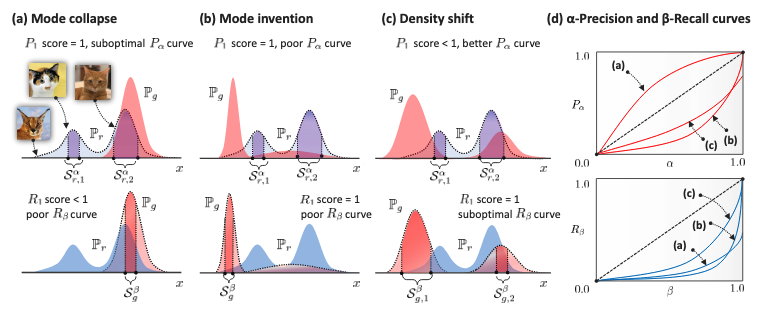
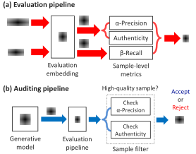
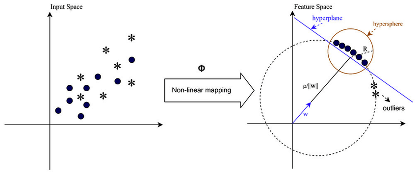
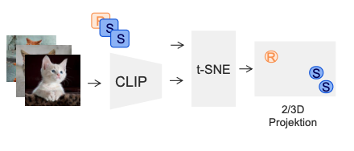
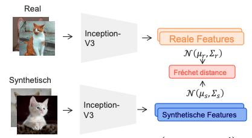

Training AI models on synthetic data is a data scientist's (and management's) dream come true. It's easy to generate in vast amounts, contains no labeling errors, and privacy concerns are virtually nonexistent. However, a frequently overlooked aspect is how to assess the quality of these synthetic samples. How can we build rich synthetic datasets that both mimic the properties of real data and introduce genuine novelty? These are challenges I frequently face in my daily work at [Atruvia](https://atruvia.de/).

A paper by Alaa et al. titled *"How Faithful is Your Synthetic Data? Sample-Level Metrics for Evaluating and Auditing Generative Models"*[^1] sheds light on these questions and caught my attention.

More specifically, it introduces a three-dimensional metric to assess the quality of generative models. This new metric is both *domain-* and *model-agnostic*. Its novelty lies in being computable at the sample level (hurray ✨), making it interesting for selecting high-quality samples for purely synthetic or hybrid datasets. Let's examine whether it lives up to its promise.

## What Makes a Good Synthetic Dataset?

Good synthetic data should fulfill the following three desirable qualities:

1. **Fidelity:** A high-fidelity synthetic dataset should contain only "realistic" samples—for instance, photorealistic images. So, no [sixth fingers](https://medium.com/@sanderink.ursina/why-do-ai-models-sometimes-produce-images-with-six-fingers-da4cd53f3313) or [pasta-eating nightmares](https://en.wikipedia.org/wiki/Will_Smith_Eating_Spaghetti_test) and butchered texts in your dataset.
2. **Diversity:** The synthetic dataset should capture the full variability of the real data, including rare edge cases.
3. **Generalization:** A synthetic dataset should contain truly novel samples, not just mere copies of the data the generative model was trained on. Without this third criterion, a strongly overfitted model could still score high on fidelity and diversity, but its outputs would just be copies, offering no real benefit.

All three aspects seem intuitive at first glance. Conveniently, the authors propose a *three-dimensional* metric, $\mathcal{E}$, that maps nicely to these three qualities.🤓[^2] The mapping is as follows: $\alpha$-precision captures *fidelity*, $\beta$-recall captures *diversity*, and *authenticity* assesses *generalization*.

While $\alpha$-precision and $\beta$-recall are generalizations of the classic precision and recall metrics, denoted by $P_1$ and $R_1$, the concept of *authenticity* is what's truly new here. This emphasis on distinguishing generalization from memorization represents one of the paper's key contributions. Let's take a closer look at the metric $\mathcal{E}$.

$$
\mathcal{E} \triangleq(\underbrace{\alpha \text{-Precision}}_{\text {Fidelity }}, \underbrace{\beta \text{-Recall}}_{\text {Diversity }}, \underbrace{\text { Authenticity }}_{\text {Generalization }}) .
$$

## $\alpha$-Precision, $\beta$-Recall, and Authenticity at three levels of understanding

### Level 1

As we know the metric is 3-dimensional. Informally and from a 10,000ft view, its dimensions are:

1. **$\alpha$-precision:** is the rate at which the generative model produces realistic looking examples.
2. **$\beta$-recall:** is the fraction of real samples that are covered by the distribution of synthetic samples.
3. **authenticity:** is the rate at which the generative model produces truly new samples. Or put differently, 1 minus the rate of samples being copied from the training set with some random noise.

That was easy, right?

### Level 2

Yet, comparing distributions including all data points isn't often desirable. The $\alpha$ and $\beta$ in alpha-precision and beta-recall indicate that we do not necessarily consider all data points within the real and generated distribution but rather allow for some data points to be *outliers*. Think of $\alpha$ and $\beta$ as the knobs to control outlierness for real and synthetic samples respectively.

Conceptually, the authors draw on minimum volume sets—regions that contain a specified probability mass while occupying the smallest possible volume. We assume that a fraction $1 - \alpha$ of the real distribution and $1 - \beta$ of the synthetic distribution represent outliers, while $\alpha$ and $\beta$ correspond to typical samples. $\alpha$ and $\beta$ are varied between 0 and 1 to obtain full recall and precision curves. This allows us to cover all possible definitions of what is considered an outlier.[^3] Without this flexibility (setting $\alpha=\beta=1$), the approach would be prone to contamination by very rare samples in both the real and synthetic datasets.

Synthetic and real samples are both embedded into hyperspheres, which have the nice property that in this space, typical examples are located in the center (modes) and outliers are pushed further to the boundary of the sphere. The hyperspheres have spherical-shaped supports, which depend on how we set $\alpha$ and $\beta$. If the radius of the hypersphere changes, so does our definition of an outlier. To summarize, a (synthetic or real) sample must lie in the $\alpha$ or $\beta$ support of its respective hypersphere to be considered typical. We'll dive more into how this setup can be used with our examples in the section on model debugging.

Now that we have this understanding of $\alpha$ and $\beta$ as hyperparameters that determine the supports of the real and synthetic hyperspheres, we can provide more precise definitions of $\alpha$-precision and $\beta$-recall:

1. **$\alpha$-precision:** The probability that a synthetic sample lies within the $\alpha$-support of the real distribution. Intuitively, $\alpha$ has an impact on the creativity allowed for generative models. For small $\alpha$ values, the generative model must produce samples closest to the most typical examples to lie within the support. For larger $\alpha$ values or a less restrictive outlier definition, it becomes more likely that a generated sample falls within the real hypersphere.
2. **$\beta$-recall:** The fraction of real samples that reside within the $\beta$-support of the synthetic distribution for a given $\beta$. By varying $\beta$, we can control the diversity of samples we allow for.
3. **Authenticity** is a hypothesis test to determine if a sample is *non-memorized*. *Memorization* means that the generative model fails to generalize and either copies or nearly replicates training samples in regions of the input space with poor coverage of training samples. While conceptually similar to *overfitting*, an overfitted model would fit the training distribution too precisely including noise and idiosyncrasies and perform poorly on the true underlying distribution.



Let's get a little bit more formal with our third level of understanding.

### Level 3

1. The paper defines $\alpha$-precision ($P_\alpha$) as the probability:

    $$
    P_\alpha \triangleq \mathbb{P}\left(\widetilde{X}_g \in \mathcal{S}_r^\alpha\right), \text { for } \alpha \in[0,1],
    $$
    for an embedded synthetic sample $\widetilde{X}_g=\Phi(X_g)$ embedded with $\Phi$ to be inside the $\alpha$-support of real samples $\mathcal{S}_r=\operatorname{supp}{(\mathbb{P}_r)}$. $\mathbb{P}_r$ is the generative distribution. $\Phi$ is an embedding function that maps input data to a feature space suitable for comparison. For a formal definition of the support please refer to the paper. By ranging $\alpha$ from 0 to 1, we get full $\alpha$-precision curves.
2. Likewise, $\beta$-recall ($R_\beta$) is formally defined as the probability:
    $$
    R_\beta \triangleq \mathbb{P}\left(\widetilde{X}_r \in \mathcal{S}_g^\beta\right), \text { for } \beta \in[0,1],
    $$
    for the embedded real sample $\widetilde{X}_r=\Phi(X_r)$ to reside in the support of the generative distribution ($\mathcal{S}_g=\operatorname{supp}{(\mathbb{P}_g)}$).

3. The authenticity score $A$ is defined as the rate by which the model generates new samples. The generative distribution is then a mixture of the generative distribution conditioned on the synthetic samples ($\mathbb{P}_g^{\prime}$) not being copied and of a noisy distribution over the training data ($\delta_{g, \epsilon}$) weighted by the *authenticity score*:
    $$
    \mathbb{P}_g=A \cdot \mathbb{P}_g^{\prime}+(1-A) \cdot \delta_{g, \epsilon}.
    $$

Let's next look at a practical example from the paper and count some kittens 🐈.

## A visual guide to $\alpha$-Precision, $\beta$-Recall, and Authenticity


<canvas id="canvas-spheres" width="660" height="371" style="width: 660px; height: 371.25px;"></canvas>
<script src="/js/dots.js"></script>
<canvas width="660" height="371" style="position: absolute; top: 0px; left: 0px; width: 660px; height: 371.25px; pointer-events: none;"></canvas>



The figure above depicts the proposed evaluation metric. The blue sphere corresponds to the $\alpha$-support of the real distribution. Likewise, the red sphere is the $\beta$-support for the generative distribution. For visualization purposes, $\alpha=\beta=0.9$. The blue and red dots correspond to real and synthetic samples.

The assumption is that data falling outside of the blue sphere will look unrealistic or noisy (case a). Overfitted generative models will produce high-quality data samples that are unauthentic because they are blunt copies from the training data (case b). High-quality samples should end up in the blue sphere/the $\alpha$-support.

Let's now calculate the metrics for a fixed $\alpha$ and $\beta$. By counting kittens, we observe that out of 10 synthetic samples, 8 lie within the blue hypersphere (the $\alpha$-support of real data). This gives us an $\alpha$-precision of $8/10 = 0.8$. Similarly, out of 10 real samples, 4 lie within the red sphere (the $\beta$-support of synthetic data), giving us a $\beta$-recall of $4/10 = 0.4$. Of all synthetic samples generated, 9 are determined to be authentic (non-memorized), which yields an authenticity score of $9/10 = 0.9$.

### Debugging failure modes with the metric

Since we can distinguish *typical* samples from *outliers*, we can also use $P_{\alpha}$ and $R_{\beta}$ for debugging purposes, as we see next.



In the graphics above, the real distribution is colored in blue, and the generative distribution is in red. $\mathbb{P}_r$ is a multimodal distribution of cat images with two modes—one for the tabby cat and another for the Calico cat. The Caracal cat (leftmost cat) is an outlier for the specific $\alpha$. The shaded areas represent the probability mass covered by $\alpha$ and $\beta$ supports.

By definition, the *support* concentrates around the modes.

We can distinguish the following cases:

1. **Optimal case:** A *perfect* generative model would result in $\alpha$-precision and $\beta$-recall curves following the diagonal.
2. **Mode collapse:** The model $\mathbb{P}_g$ exhibits *mode collapse*, as it fails to represent all modes (mode for Calico cat missing). We'd get a suboptimal, concave $\alpha$-precision curve, as fewer synthetic samples are in the $\alpha$-support than there should be. Because it does not cover all modes, the model will have a suboptimal (below diagonal) $R_\beta$ curve. The same model would achieve perfect precision scores ($P_1$), but poor recall ($R_1$).
3. **Mode invention:** The model captures the support for $\mathbb{P}_r$ well, and hence achieves perfect recall/precision ($P_1=R_1=1$) as the entire distribution is covered by support. The generative model, however, invents a new mode for the Caracal cat/outlier, resulting in poor $P_{\alpha}$ and $R_{\beta}$ scores as neither typical synthetic samples nor typical real samples are well covered in the other distribution.
4. **Density shift:** The last case is more subtle to spot. The model realizes both types of cats but estimates a slightly shifted support and density. Intuitively, the model is the best of all three models but will appear inferior to model 2 under classical precision and recall. This "improvement", however, is reflected in an improved $P_\alpha$ score and a (still) suboptimal $R_\beta$ curve.

It's also possible to summarize performance using single scalars instead of curves. Based on $P_\alpha$ or $R_\beta$ curves and the diagonal, we can derive the *integrated* $P_\alpha$ ($\operatorname{IP}_{\alpha}$) and *integrated* $R_\beta$ $(\operatorname{IR}_{\beta})$, which is simply the $1 - 2 \times$ the area enclosed between the $\alpha$-precision and $\beta$-recall curves and the diagonal.

```yaml
TODO: add d3.js plot and visualize how IP and IR changes.
```

## Use in evaluation and auditing tasks

Let's next see how we can use $\alpha$-precision, $\beta$-recall, and authenticity to our advantage for auditing the generative model and evaluating $\mathcal{E}$ on the embedded images.



**Evaluation pipeline:** The first application lies in *evaluation* the generative model. By embedding the input features into a feature space, we can evaluate $\mathcal{E}$ on the embedded real/generated features. This allows us to assess the quality of our synthetic data for the desired qualities and ultimately determine how much faith we can place in our synthetic data.

**Auditing pipeline:** For practitioners, an even more interesting application is found in *post-hoc* model auditing.[^4] Since the metric can be estimated at the sample level, for each sample $X_{g,j}$ in the synthetic dataset $\mathcal{D}_\text{synth}$, we can use the approach to reject samples with low authenticity and/or $\alpha$-precision scores and select (and regenerate) high-quality samples. The auditor thereby acts as a rejection sampler. One important detail: for auditing purposes, we don't focus on $\beta$-recall since we're primarily concerned with the quality of individual synthetic samples rather than coverage of the real distribution.

Until now it remains unclear what approach we can use to generate the embeddings, how we construct the hyperspheres, how we measure proximity, and how the metrics themselves are calculated over the hyperspheres. Let's tackle this next.

## From kittens to practical implementation

Let's next see what is needed to implement the approach practically.

1. **Evaluation embeddings:** Evaluation embeddings are learned using a simple *one-class* neural network with a loss function inspired *one-class* support-vector machines (SVMs). The neural networks is rather simplistic with 2 to 3 layers, ahidden dimension of 32 to 128, and a good old ReLU activation. We learn the parameters on *real samples*. The *soft-boundary loss function* is given by $L=\sum_i \ell_i$ where:

    $$
    \ell_i=r^2+\frac{1}{\nu} \max \left\{0,\left\|\Phi\left(X_{r, i}\right)-c_r\right\|^2-r^2\right\}
    $$
    This formula deserves some more explanation. We first map the inputs $X_{r,i}$ into the embedding space, where typical data points and outliers are more easily separable from the origin. We then try to find an optimal separating hyperplane/decision boundary. $\nu$ controls the fraction of outliers/tolerance that may violate the decision boundary. The paper sets $\nu=0.1$. The max-term penalizes for larger margin violations. $c_r$ is the centre from which the Euclidean distance between the sample and the centroid is measured.
    The loss is minimized over the radius $r$ and the parameters of $\Phi$. The embedding dimension, centroids, and $\nu$ are hyperparameters that potentially require tuning.

    A pytorch implementation of the soft-boundary loss would look like this:

    ```python
    import torch

    def soft_boundary_loss(emb: torch.Tensor, r: float, c: torch.Tensor, nu: float) -> float:
        """Soft-boundary loss.

        Args:
            emb (torch.Tensor): embedding
            r (float): radius
            c (torch.Tensor): centroid
            nu (float): weight term

        Returns:
            float: loss
        """
        dist = torch.sum((emb - c) ** 2, dim=1)
        scores = dist - r**2
        loss = r**2 + (1 / nu) * torch.mean(torch.nn.ReLU(scores))

        return loss
    ```

```python
# one-class network code from: https://github.com/KarelZe/evaluating-generative-models/blob/main/representations/OneClass.py
# TODO: Simplify into simple train-val loop. Use MNIST Fashion dataset.

# Copyright (c) 2021, Ahmed M. Alaa
# Licensed under the BSD 3-clause license (see LICENSE.txt)

"""

  -----------------------------------------
  One-class representations
  -----------------------------------------

"""

from __future__ import absolute_import, division, print_function

import numpy as np
import sys

import logging
import torch
import torch.nn as nn

if not sys.warnoptions:
    import warnings
    warnings.simplefilter("ignore")

from representations.networks import *

from torch.autograd import Variable

# One-class loss functions
# ------------------------


def OneClassLoss(outputs, c):

    dist   = torch.sum((outputs - c) ** 2, dim=1)
    loss   = torch.mean(dist)

    return loss


def SoftBoundaryLoss(outputs, R, c, nu):

    dist   = torch.sum((outputs - c) ** 2, dim=1)
    scores = dist - R ** 2
    loss   = R ** 2 + (1 / nu) * torch.mean(torch.max(torch.zeros_like(scores), scores))

    scores = dist
    loss   = (1 / nu) * torch.mean(torch.max(torch.zeros_like(scores), scores))

    return loss


LossFns    = dict({"OneClass": OneClassLoss, "SoftBoundary": SoftBoundaryLoss})

# Base network
# ---------------------

class BaseNet(nn.Module):

    """Base class for all neural networks."""

    def __init__(self):

        super().__init__()

        self.logger  = logging.getLogger(self.__class__.__name__)
        self.rep_dim = None  # representation dimensionality, i.e. dim of the last layer

    def forward(self, *input):

        """Forward pass logic

        :return: Network output
        """
        raise NotImplementedError

    def summary(self):

        """Network summary."""

        net_parameters = filter(lambda p: p.requires_grad, self.parameters())
        params         = sum([np.prod(p.size()) for p in net_parameters])

        self.logger.info('Trainable parameters: {}'.format(params))
        self.logger.info(self)


def get_radius(dist:torch.Tensor, nu:float):

    """Optimally solve for radius R via the (1-nu)-quantile of distances."""

    return np.quantile(np.sqrt(dist.clone().data.float().numpy()), 1 - nu)

class OneClassLayer(BaseNet):

    def __init__(self, params=None, hyperparams=None):

        super().__init__()

        # set all representation parameters - remove these lines

        self.rep_dim        = params["rep_dim"]
        self.input_dim      = params["input_dim"]
        self.num_layers     = params["num_layers"]
        self.num_hidden     = params["num_hidden"]
        self.activation     = params["activation"]
        self.dropout_prob   = params["dropout_prob"]
        self.dropout_active = params["dropout_active"]
        self.loss_type      = params["LossFn"]
        self.train_prop     = params['train_prop']
        self.learningRate   = params['lr']
        self.epochs         = params['epochs']
        self.warm_up_epochs = params['warm_up_epochs']
        self.weight_decay   = params['weight_decay']
        if torch.cuda.is_available():
            self.device     = torch.device('cuda') # Make this an option
        else:
            self.device     = torch.device('cpu')
        # set up the network

        self.model          = build_network(network_name="feedforward", params=params).to(self.device)

        # create the loss function

        self.c              = hyperparams["center"].to(self.device)
        self.R              = hyperparams["Radius"]
        self.nu             = hyperparams["nu"]

        self.loss_fn        = LossFns[self.loss_type]


    def forward(self, x):

        x                   = self.model(x)

        return x


    def fit(self, x_train, verbosity=True):


        self.optimizer      = torch.optim.AdamW(self.model.parameters(), lr=self.learningRate, weight_decay = self.weight_decay)
        self.X              = torch.tensor(x_train.reshape((-1, self.input_dim))).float()

        if self.train_prop != 1:
            x_train, x_val = x_train[:int(self.train_prop*len(x_train))], x_train[int(self.train_prop*len(x_train)):]
            inputs_val = Variable(torch.from_numpy(x_val).to(self.device)).float()

        self.losses         = []
        self.loss_vals       = []


        for epoch in range(self.epochs):

            # Converting inputs and labels to Variable

            inputs = Variable(torch.from_numpy(x_train)).to(self.device).float()

            self.model.zero_grad()

            self.optimizer.zero_grad()

            # get output from the model, given the inputs
            outputs = self.model(inputs)

            # get loss for the predicted output

            if self.loss_type=="SoftBoundary":

                self.loss = self.loss_fn(outputs=outputs, R=self.R, c=self.c, nu=self.nu)

            elif self.loss_type=="OneClass":

                self.loss = self.loss_fn(outputs=outputs, c=self.c)


            #self.c    = torch.mean(torch.tensor(outputs).float(), dim=0)

            # get gradients w.r.t to parameters
            self.loss.backward(retain_graph=True)
            self.losses.append(self.loss.detach().cpu().numpy())

            # update parameters
            self.optimizer.step()

            if (epoch >= self.warm_up_epochs) and (self.loss_type=="SoftBoundary"):

                dist   = torch.sum((outputs - self.c) ** 2, dim=1)
                #self.R = torch.tensor(get_radius(dist, self.nu))

            if self.train_prop != 1.0:
                with torch.no_grad():

                    # get output from the model, given the inputs
                    outputs = self.model(inputs_val)

                    # get loss for the predicted output

                    if self.loss_type=="SoftBoundary":

                        loss_val = self.loss_fn(outputs=outputs, R=self.R, c=self.c, nu=self.nu)

                    elif self.loss_type=="OneClass":

                        loss_val = self.loss_fn(outputs=outputs, c=self.c).detach.cpu().numpy()

                    self.loss_vals.append(loss_val)


            if verbosity:
                if self.train_prop == 1:
                    print('epoch {}, loss {}'.format(epoch, self.loss.item()))
                else:
                    print('epoch {:4}, train loss {:.4e}, val loss {:.4e}'.format(epoch, self.loss.item(),loss_val))

```


2. **Precision and Recall:** Just like we counted and averaged the samples within/outside the hypersphere above, an [indicator function](https://en.wikipedia.org/wiki/Indicator_function) ($\mathbf{1}$) is first used to assign binary scores for all synthetic and real samples respectively, whether the sample resides in $\alpha$ or $\beta$-support for a given $\alpha$ or $\beta$ and calculate the mean over all samples in the dataset to obtain the final scores. Hence, their binary classifiers are: $f_P\left(\tilde{X}_g\right)=\mathbf{1}\left\{\tilde{X}_g \in \hat{\mathcal{S}}_r^\alpha\right\}$ and $f_R\left(\tilde{X}_r\right)=\mathbf{1}\left\{\tilde{X}_r \in \widehat{\mathcal{S}}_g^\beta\right\}$. The hats here indicate that we work on estimates.

```python
# adapted from: https://github.com/KarelZe/evaluating-generative-models/blob/main/metrics/evaluation.py
# TODO: simplify.
from __future__ import absolute_import, division, print_function

import numpy as np
import sys
from sklearn.neighbors import NearestNeighbors

import logging
import torch
import scipy

if not sys.warnoptions:
    import warnings
    warnings.simplefilter("ignore")

device = 'cpu' # matrices are too big for gpu


def compute_alpha_precision(real_data, synthetic_data, emb_center):


    emb_center = torch.tensor(emb_center, device=device)

    n_steps = 30
    nn_size = 2
    alphas  = np.linspace(0, 1, n_steps)


    Radii   = np.quantile(torch.sqrt(torch.sum((torch.tensor(real_data).float() - emb_center) ** 2, dim=1)), alphas)

    synth_center          = torch.tensor(np.mean(synthetic_data, axis=0)).float()

    alpha_precision_curve = []
    beta_coverage_curve   = []

    synth_to_center       = torch.sqrt(torch.sum((torch.tensor(synthetic_data).float() - emb_center) ** 2, dim=1))


    nbrs_real = NearestNeighbors(n_neighbors = 2, n_jobs=-1, p=2).fit(real_data)
    real_to_real, _       = nbrs_real.kneighbors(real_data)

    nbrs_synth = NearestNeighbors(n_neighbors = 1, n_jobs=-1, p=2).fit(synthetic_data)
    real_to_synth, real_to_synth_args = nbrs_synth.kneighbors(real_data)

    # Let us find closest real point to any real point, excluding itself (therefore 1 instead of 0)
    real_to_real          = torch.from_numpy(real_to_real[:,1].squeeze())
    real_to_synth         = torch.from_numpy(real_to_synth.squeeze())
    real_to_synth_args    = real_to_synth_args.squeeze()

    real_synth_closest    = synthetic_data[real_to_synth_args]

    real_synth_closest_d  = torch.sqrt(torch.sum((torch.tensor(real_synth_closest).float()- synth_center) ** 2, dim=1))
    closest_synth_Radii   = np.quantile(real_synth_closest_d, alphas)


    for k in range(len(Radii)):
        precision_audit_mask = (synth_to_center <= Radii[k]).detach().float().numpy()
        alpha_precision      = np.mean(precision_audit_mask)

        beta_coverage        = np.mean(((real_to_synth <= real_to_real) * (real_synth_closest_d <= closest_synth_Radii[k])).detach().float().numpy())

        alpha_precision_curve.append(alpha_precision)
        beta_coverage_curve.append(beta_coverage)


    # See which one is bigger

    authen = real_to_real[real_to_synth_args] < real_to_synth
    authenticity = np.mean(authen.numpy())

    Delta_precision_alpha = 1 - 2 * np.sum(np.abs(np.array(alphas) - np.array(alpha_precision_curve))) * (alphas[1] - alphas[0])
    Delta_coverage_beta  = 1 - 2 * np.sum(np.abs(np.array(alphas) - np.array(beta_coverage_curve))) * (alphas[1] - alphas[0])

    return alphas, alpha_precision_curve, beta_coverage_curve, Delta_precision_alpha, Delta_coverage_beta, authenticity
```


<canvas id="canvas-tangent-space" width="660" height="371" style="width: 660px; height: 371.25px;"></canvas>
<script src="/js/tangent.js"></script>
<canvas width="660" height="371" style="position: absolute; top: 0px; left: 0px; width: 660px; height: 371.25px; pointer-events: none;"></canvas>



3. **Authenticity:** the authenticity classifier is modelled as a hypothesis test that tests if a synthetic sample is non-memorized using a *likelihood ratio statistic*. Practically, we test if the distance between a synthetic sample and its **closest real training sample** is smaller than the distance between the closest real sample to its nearest real sample (other than itself). Again, an indicator function is used to assign binary scores and the final score is averaged from all synthetic samples.

4. **supports/minimum-volume hypersphere:** The centres are external hyperparameters.

```yaml
TODO: its unclear to me, what the k-nn is used for.
```

## Does It Scale?

The scalability appears promising based on the paper's experiments. The datasets used range from 6k to 10k samples, which is reasonable for many practical applications.

The computational demand is primarily affected by the embedding dimension $d_{\text{emb}}$ rather than the input dimension, since both $k$-nearest neighbor computations for mode estimation and distance calculations are performed in the embedding space. This makes the approach more scalable than methods that operate directly in high-dimensional input spaces.

## Where existing approaches fall short

Two commonly used techniques to assess the quality of synthetic datasets among practitioners involve visualization or comparing distributions of real and synthetic samples.



```yaml
TODO: translate + make a svg
```

For dataset visualization, inputs like images are frequently embedded using encoders like CLIP and then projected into 2D or 3D space for visualization using dimensionality reduction approaches like $t$-SNE or UMAP. While conceptually simple, this approach allows only for qualitative assessments and heavily relies on the embedding model and the dimensionality reduction technique. Additionally, $t$-SNE plots have been deemed mysterious and misleading.[^6] In contrast, the Alaa paper does not require another embedding model and uses model- and domain-agnostic feature embeddings.

A second popular approach is to compare real and synthetic datasets with metrics like the [Fréchet Inception Distance](https://en.wikipedia.org/wiki/Fr%C3%A9chet_inception_distance) (FID).



```yaml
TODO: translate + make a svg
```

For the FID, synthetic and real images are first embedded using the [Inception v3 model](https://en.wikipedia.org/wiki/Inception_(deep_learning_architecture)) and the resulting feature vectors are used to parameterize multivariate distributions for the real dataset $\mathcal{N}\left(\boldsymbol{\mu}_{r}, \boldsymbol{\Sigma}_{r}\right)$ and generated dataset $\mathcal{N}\left(\boldsymbol{\mu}_{s}, \boldsymbol{\Sigma}_{s}\right)$. The discrepancy between both distributions can then be estimated as:

$$
\operatorname{FID}\left(\boldsymbol{\mu}_r, \boldsymbol{\Sigma}_r, \boldsymbol{\mu}_s, \boldsymbol{\Sigma}_s\right)=\left\|\boldsymbol{\mu}_r-\boldsymbol{\mu}_s\right\|_2^2+\operatorname{Tr}\left(\boldsymbol{\Sigma}_r+\boldsymbol{\Sigma}_s-2\left(\boldsymbol{\Sigma}_r \boldsymbol{\Sigma}_s\right)^{\frac{1}{2}}\right)
$$

Unlike the current paper, FID is only computable at the dataset level and considers only *diversity* and *fidelity*. Most critically, it would assign optimal scores to a model that simply memorizes the training/real dataset.

## Experiments

To validate their proposed metrics, Alaa and colleagues designed four experiments covering model evaluation and auditing.

*Experiment 1:*

For the *evaluation setting*, they tested whether evaluation metrics can correctly rank generative models by their quality. The authors generated four synthetic COVID-19 patient datasets using different generative models and used them to train simple logistic regression models. The real-world performance of these models established a "ground truth" ranking.

They found that their proposed metrics, integrated $\alpha$-precision ($\operatorname{IP}_{\alpha}$) and integrated $\beta$-recall ($\operatorname{IR}_{\beta}$), successfully reproduced this ground truth ranking, outperforming most standard metrics like FID and Precision/Recall.

In a second related experiment, they demonstrated the performance of their approach as a criterion for finding a weighting hyperparameter of a privacy-preserving loss function for ADS-GAN.

Their third corresponding experiment focused on *model auditing*. Their results show that the ADS-GAN achieved a marginally larger AUC-ROC score on audited/pre-filtered synthetic samples.

*Experiment 2:*

This experiment tackled mode dropping, a common failure where a generative model misses entire categories of data (e.g., a model trained on digits 0-9 fails to generate any '8's). Using a modified MNIST dataset, the authors showed that their $\operatorname{IR}_{\beta}$ metric was significantly more sensitive to this problem than baseline approaches like FID, Precision, and Recall.

*Experiment 3:*

Here, the authors re-evaluated models from a "Hide-and-Seek" challenge focused on generating private synthetic patient data. The original winner—a simple model that just added noise to real data—scored well on standard metrics but offered poor privacy.

The authors demonstrated that their authenticity metric would have correctly flagged this model as low-quality, thereby exposing the privacy risk that other metrics missed.

*Experiment 4:*

In the last experiment, they evaluated the performance of StyleGAN and diffusion probabilistic models (DDPM) pre-trained on the CIFAR-10 dataset, generated 10,000 samples each, and compared against real samples using FID and $\operatorname{IP}_{\alpha}$ and $\operatorname{IR}_{\beta}$.

## What similarity metrics won't tell you

This approach won't tell you, whether training a generator model and sampling synthetic samples provides any benefits over training an a subset of upstream samples directly. This quetion has been addressed by more recent papers. [^7]


## My Thoughts

The paper presents a fresh and novel take on assessing the quality of synthetic data. I particularly appreciate that there's finally a solution for sample-level evaluation that can be applied universally as long as we can input data into evaluation embeddings.

My main concern relates to practical applicability. The setup requires multiple parameters like $r$, $\nu$, and $\Phi$ for the one-class classifiers that require tuning, as well as hyperparameters like $k$ for Mini-Batch $k$-means for constructing the hyperspheres.

Ultimately, I remain skeptical about their experiments. While the experiments demonstrate applicability across various modalities (image, tabular, etc.), the selection seems somewhat superficial, the models are dated, and the evaluation partly lacks quantitative rigor. For example, their final experiment would have benefited from an arena-like human evaluation compared to the metrics. This view is shared by some reviewers on [openreview.net](https://openreview.net/forum?id=8qWazUd8Jm). What are your thoughts?

[^1]: see https://arxiv.org/abs/2102.08921

[^2]: Nobody seems to have coined a name for the metric yet. Feel free to propose one!

[^3]: Conceptually, this reminded me of [DBSCAN](https://en.wikipedia.org/wiki/DBSCAN) and its hyperparameter $\epsilon$.

[^4]: Post-hoc means here that we leave our generative model as-is.

[^5]: See: https://arxiv.org/pdf/2106.03216

[^6]: See [this distill.pub](https://distill.pub/2016/misread-tsne/) article for using $t$-SNE effectively.

[^7]: See: https://arxiv.org/pdf/2406.05184
