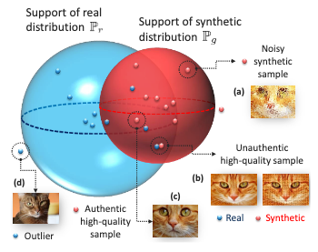

Training AI models on synthetic data is a data scientist's (and management's) dream come true. It's easy to generate in vast amounts, contains no labeling errors, and privacy concerns are virtually nonexistent. However, a frequently overlooked aspect is how to assess the quality of these synthetic samples. How can we build rich synthetic datasets that both mimic the properties of real data and introduce genuine novelty? These are challenges I frequently face in my daily work at [Atruvia](https://atruvia.de/).

A paper by Alaa et al. titled "How Faithful is Your Synthetic Data? Sample-Level Metrics for Evaluating and Auditing Generative Models"[^1] sheds light on these questions and sparked my interest. More specifically, it introduces a three-dimensional metric to assess the quality of generative models.

This new metric is both *domain-* and *model-agnostic*. Its novelty lies in being computable at the sample level (hurray 🎉), making it interesting for selecting high-quality samples for purely synthetic or hybrid datasets. Let's see if it holds up to scrutiny.

### What Makes a Good Synthetic Dataset?

Good synthetic data should fulfill the following three qualities:

1. **Fidelity:** A high-fidelity synthetic dataset should contain only "realistic" samples—for instance, photorealistic images. So, no [sixth fingers](https://medium.com/@sanderink.ursina/why-do-ai-models-sometimes-produce-images-with-six-fingers-da4cd53f3313) or [pasta-eating nightmares](https://en.wikipedia.org/wiki/Will_Smith_Eating_Spaghetti_test) in your dataset.
1. **Diversity:** The synthetic dataset should capture the full variability of the real data, including rare edge cases.
1. **Generalization:** A synthetic dataset should contain truly novel samples, not just mere copies of the data the generative model was trained on. Without this third criterion, a strongly overfitted model could still score high on fidelity and diversity, but its outputs would just be copies, offering no real benefit.

All three aspects seem intuitive at first glance. As it happens, the authors propose a *three-dimensional* metric, $\mathcal{E}$, that maps nicely to these three qualities.🤓[^2] The mapping is as follows: $\alpha$-precision captures *fidelity*, $\beta$-recall captures *diversity*, and *authenticity* assesses *generalization*.

While $\alpha$-precision and $\beta$-recall are generalizations of the classic precision and recall metrics, the concept of *authenticity* is what's truly new here. This focus on generalization versus memorization is one of the paper's key contributions. Let's take a closer look at the metric $\mathcal{E}$.

$$
\mathcal{E} \triangleq(\underbrace{\alpha \text{-Precision}}_{\text {Fidelity }}, \underbrace{\beta \text{-Recall}}_{\text {Diversity }}, \underbrace{\text { Authenticity }}_{\text {Generalization }}) .
$$

### α-Precision, β-Recall, and Authenticity at two levels of understanding

**level 1:**

As we know the metric is 3-dimensional. Informally and from a 10,000ft view, its dimensions are:

1. **$\alpha$-precision:** is the rate at which the generative model produces realistic looking examples.
1. **$\beta$-recall:** is the fraction of real samples, that are covered by the distribution of synthetic samples.
1. **authenticity:** is the rate at which the generative model produces truly new samples. Or put differently, 1 minus the rate of samples being copied form the training set with some noise.

That was easy, right?

**level 2:**

Yet, comparing distributions incl. all data points isn't often desirable. The $\alpha$ and $\beta$ in alpha-precision and beta-recall indicates that we do not necessarily consider all data points within $\mathbb{P}_g$ or $\mathbb{P}_r$ but rather allow for some data points to be *outliers*. Think of $\alpha$ and $\beta$ being the knobs to control outlierness for synthetic and real samples.

Conceptually, the authors draw on minimum volume sets - sets that contain a specified probability mass with the smallest possible volume. We assume that a fraction $1 - \alpha$ for real samples and $1 - \beta$ for synthetic samples are outliers, while $\alpha$ and $\beta$ are typical. $\alpha$ and $\beta$ are varied between 0 and 1 to obtain full recall and precision curves. Thereby, we can also cover all possible definitions of what is considered as an outlier. [^3] I suspect that without this (setting $\alpha=\beta=1$), the approach would be prone to very rare samples in both the real and synthetic dataset.

Synthetic and real samples are both embedded into hyperspheres, which have the nice property that in this space, typical examples are located in the centre (modes) and outliers are pushed further to the boundary of the sphere. The hyperspheres have spherical-shaped supports, which depend on how we set $\alpha$ and $\beta$. If the radius of the hypersphere changes and so does our definition of an outlier. To summarize, a (synthetic or real) sample must lie in the $\alpha$ or $\beta$ support of its hypersphere to be considered typical. We dive more into how this setup can be used to our examples in the section on model debugging.

With our newly gained understanding of $\alpha$ and $\beta$ as a hyperparameter to determine the supports of the real and synthetic hypersphere, we are all set for a more precise definition of $\alpha$-precision and $\beta$-recall:

1. **$\alpha$-precision:** The probability that a synthetic sample lies within the $\alpha$-support of the real distribution. Intuitively, $\alpha$ has an impact on the creativity of the generative models. For small $\alpha$s the generative model must produce samples closest to the most typical examples to lie within the support. For larger $\alpha$s or a less restrictive outlier definition it becomes more likely that a generated sample sneaks into the real hypersphere.
1. **$\beta$-recall:** The fraction of real samples that reside within the $\beta$-support of the synthetic distribution for a given $\beta$. Being able to vary $\beta$, we can control the diversity of samples we allow for.

Let's next look at a practical example from the paper and count some kittens 🐈.

### A visual guide to $\alpha$-Precision, $\beta$-Recall, and Authenticity



The figure above depicts the proposed evaluation metric. The blue sphere corresponds to the $\alpha$-support of the real distribution. Likewise, the red sphere is the $\beta$-support for the generative distributions. For visualization sake, $\alpha=\beta=0.9$. The blue and red dots correspond to real and synthetic samples.

The assumption is now, that data falling outside of the blue sphere will look unrealistic or noisy (case a). Overfitted generative models, will produce high-quality data samples, that are unauthentic, because they are blunt copies from the training data (case b). High-quality samples should end up in the blue sphere/the $\alpha$-support.

Let's now calculate the metrics, for a fixed $\alpha$ and $\beta$. By counting kittens, we observe that out of 10 synthetic samples, 9 are typical cat images and 1 is an outlier. Out of 9, 8 also lie within the blue hypersphere. That gives us an $\alpha$-precision of $8/9$. Similarly, out of 9 typical synthetic samples, 4 are in the red sphere, this gives a $\beta$-recall of $4/9$. Of all synthetic samples generated, only one is unauthentic, which yields an authenticity of $9/10$.

```yaml
TODO: It's not clear to my why outliers in the own hypersphere are also excluded. This would mean we both depend on beta and alpha. From the formulas I'd think, that we take *all* synthetic / real samples.
```

### Debugging Failure Modes with the Metric

```yaml
TODO:
```

### From Kittens to a Practical Implementation

```yaml
TODO:
```

### Does It Scale?

```yaml
TODO:
```

### Why Existing Metrics Fall Short

```yaml
TODO:
```

### Final Thoughts

```yaml
TODO:
```

[^1]: see https://arxiv.org/abs/2102.08921

[^2]: Seems like nobody has coined a name for the metric yet. Feel free to propose

[^3]: Conceptually, this reminded me to [DBSCAN](https://en.wikipedia.org/wiki/DBSCAN) and its hyperparameter $\epsilon$.
