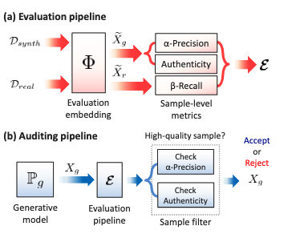
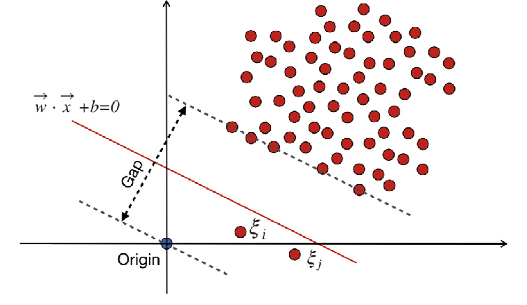

Training AI models on synthetic data is a data scientist's (and management's) dream come true. It's easy to generate in vast amounts, contains no labeling errors, and privacy concerns are virtually nonexistent. However, a frequently overlooked aspect is how to assess the quality of these synthetic samples. How can we build rich synthetic datasets that both mimic the properties of real data and introduce genuine novelty? These are challenges I frequently face in my daily work at [Atruvia](https://atruvia.de/).

A paper by Alaa et al. titled "How Faithful is Your Synthetic Data? Sample-Level Metrics for Evaluating and Auditing Generative Models"[^1] sheds light on these questions and sparked my interest. More specifically, it introduces a three-dimensional metric to assess the quality of generative models.

This new metric is both *domain-* and *model-agnostic*. Its novelty lies in being computable at the sample level (hurray 🎉), making it interesting for selecting high-quality samples for purely synthetic or hybrid datasets. Let's see if it holds up to scrutiny.

## What Makes a Good Synthetic Dataset?

Good synthetic data should fulfill the following three desirable qualities:

1. **Fidelity:** A high-fidelity synthetic dataset should contain only "realistic" samples—for instance, photorealistic images. So, no [sixth fingers](https://medium.com/@sanderink.ursina/why-do-ai-models-sometimes-produce-images-with-six-fingers-da4cd53f3313) or [pasta-eating nightmares](https://en.wikipedia.org/wiki/Will_Smith_Eating_Spaghetti_test) in your dataset.
1. **Diversity:** The synthetic dataset should capture the full variability of the real data, including rare edge cases.
1. **Generalization:** A synthetic dataset should contain truly novel samples, not just mere copies of the data the generative model was trained on. Without this third criterion, a strongly overfitted model could still score high on fidelity and diversity, but its outputs would just be copies, offering no real benefit.

All three aspects seem intuitive at first glance. As it happens, the authors propose a *three-dimensional* metric, $\mathcal{E}$, that maps nicely to these three qualities.🤓[^2] The mapping is as follows: $\alpha$-precision captures *fidelity*, $\beta$-recall captures *diversity*, and *authenticity* assesses *generalization*.

While $\alpha$-precision and $\beta$-recall are generalizations of the classic precision and recall metrics, denoted by $R_1$ and $P_1$, the concept of *authenticity* is what's truly new here. This focus on generalization versus memorization is one of the paper's key contributions. Let's take a closer look at the metric $\mathcal{E}$.

$$
\mathcal{E} \triangleq(\underbrace{\alpha \text{-Precision}}_{\text {Fidelity }}, \underbrace{\beta \text{-Recall}}_{\text {Diversity }}, \underbrace{\text { Authenticity }}_{\text {Generalization }}) .
$$

## $\alpha$-Precision, $\beta$-Recall, and Authenticity at three levels of understanding

**level 1:**

As we know the metric is 3-dimensional. Informally and from a 10,000ft view, its dimensions are:

1. **$\alpha$-precision:** is the rate at which the generative model produces realistic looking examples.
1. **$\beta$-recall:** is the fraction of real samples, that are covered by the distribution of synthetic samples.
1. **authenticity:** is the rate at which the generative model produces truly new samples. Or put differently, 1 minus the rate of samples being copied form the training set with some random noise.

That was easy, right?

**level 2:**

Yet, comparing distributions incl. all data points isn't often desirable. The $\alpha$ and $\beta$ in alpha-precision and beta-recall indicates that we do not necessarily consider all data points within $\mathbb{P}_g$ or $\mathbb{P}_r$ but rather allow for some data points to be *outliers*. Think of $\alpha$ and $\beta$ being the knobs to control outlierness for synthetic and real samples.

Conceptually, the authors draw on minimum volume sets - sets that contain a specified probability mass with the smallest possible volume. We assume that a fraction $1 - \alpha$ for real samples and $1 - \beta$ for synthetic samples are outliers, while $\alpha$ and $\beta$ are typical. $\alpha$ and $\beta$ are varied between 0 and 1 to obtain full recall and precision curves. Thereby, we can also cover all possible definitions of what is considered as an outlier. [^3] Without this (setting $\alpha=\beta=1$), the approach would be prone to very rare samples in both the real and synthetic dataset.

Synthetic and real samples are both embedded into hydrospheres, which have the nice property that in this space, typical examples are located in the centre (modes) and outliers are pushed further to the boundary of the sphere. The hydrospheres have spherical-shaped supports, which depend on how we set $\alpha$ and $\beta$. If the radius of the hypersphere changes and so does our definition of an outlier. To summarize, a (synthetic or real) sample must lie in the $\alpha$ or $\beta$ support of its hypersphere to be considered typical. We dive more into how this setup can be used to our examples in the section on model debugging.

With our newly gained understanding of $\alpha$ and $\beta$ as a hyperparameter to determine the supports of the real and synthetic hypersphere, we are all set for a more precise definition of $\alpha$-precision and $\beta$-recall:

1. **$\alpha$-precision:** The probability that a synthetic sample lies within the $\alpha$-support of the real distribution. Intuitively, $\alpha$ has an impact on the creativity of the generative models. For small $\alpha$ s the generative model must produce samples closest to the most typical examples to lie within the support. For larger $\alpha$s or a less restrictive outlier definition it becomes more likely that a generated sample sneaks into the real hypersphere.
1. **$\beta$-recall:** The fraction of real samples that reside within the $\beta$-support of the synthetic distribution for a given $\beta$. Being able to vary $\beta$, we can control the diversity of samples we allow for.
1. **Authenticity** is a hypothesis test to test if a sample is *non-memorized*. *Memorization* means that the generative model covers regions in the support of the synthetic data distribution, despite that only few data points lie within this region. While conceptually similar to the more common overfitting, a overfitted model would fit the original distribution/histogram. [^5]

Let's get a little bit more formal.

**level 3:**

1. The paper defines $\alpha$-precision as the probability:

    $$
    P_\alpha \triangleq \mathbb{P}\left(\widetilde{X}_g \in \mathcal{S}_r^\alpha\right), \text { for } \alpha \in[0,1],
    $$
    for an embedded, synthetic sample $\widetilde{X}_g=\Phi(X_g)$ to be inside the $\alpha$-support of real samples $\mathcal{S}_r=\operatorname{supp}{(\mathbb{P}_r)}$. By ranging $\alpha$ from 0 to 1, we get full $\alpha$-precision curves✨.
2. Likewise, $\beta$-recall is formally defined as the probability:
    $$
    R_\beta \triangleq \mathbb{P}\left(\widetilde{X}_r \in \mathcal{S}_g^\beta\right), \text { for } \beta \in[0,1],
    $$
    for the embedded, real sample $\widetilde{X}_r=\Phi(X_r)$ to reside in the $\mathcal{S}_g=\operatorname{supp}{(\mathbb{P}_g)}$.

3. Authenticity is defined as (TODO:).

Let's next look at a practical example from the paper and count some kittens 🐈.

## A visual guide to $\alpha$-Precision, $\beta$-Recall, and Authenticity


The figure above depicts the proposed evaluation metric. The blue sphere corresponds to the $\alpha$-support of the real distribution. Likewise, the red sphere is the $\beta$-support for the generative distributions. For visualization sake, $\alpha=\beta=0.9$. The blue and red dots correspond to real and synthetic samples.

The assumption is now, that data falling outside of the blue sphere will look unrealistic or noisy (case a). Overfitted generative models, will produce high-quality data samples, that are unauthentic, because they are blunt copies from the training data (case b). High-quality samples should end up in the blue sphere/the $\alpha$-support.

Let's now calculate the metrics, for a fixed $\alpha$ and $\beta$. By counting kittens, we observe that out of 10 synthetic samples, 9 are typical cat images and 1 is an outlier. Out of 9, 8 also lie within the blue hypersphere. That gives us an $\alpha$-precision of $8/9$. Similarly, out of 9 typical synthetic samples, 4 are in the red sphere, $\beta$-recall is $4/9$. Of all synthetic samples generated, only one is unauthentic, which yields an authenticity of $9/10$.

```yaml
TODO: It's not clear to my why outliers in the own hypersphere are also excluded. This would mean we both depend on beta and alpha. From the formulas I'd think, that we take *all* synthetic / real samples.
```

### Debugging Failure Modes with the Metric

As we can distinguish *typical* samples and *outliers*, we can also use $P_{\alpha}$ and $R_{\beta}$ for debugging purposes, as we see next.


In the graphics above, the real distribution is colored in blue, and the generative distribution is in red.  $\mathbb{P}_r$ is a a multimodal distribution of cat images with two modes -- one for the tabby cat and another one for the Calico cat. The Carcal cat (left most cat) is an outlier for the specific $\alpha$. The shaded areas represent the probability mess covered by $\alpha$ and $\beta$ supports.

By definition, the *support* concentrate around the modes.

We can distinguish following cases:

1. A *perfect* generative model would result in a $\alpha$-precision and $\beta$ -recall following the diagonal.
1. The model $\mathbb{P}_g$ exhibits *mode collapse*, as it fails to represent all modes (mode for Calico cat missing). We'd get a suboptimal, concave $\alpha$-precision curve, as more synthetic samples are in the $\alpha$-support than there should be. Because it does not cover all modes, the model will have a sub-optimal (below diagonal) $R_\beta$ curve. The same model would achieve perfect precision scores ($P_1$), but poor recall ($R_1$).
1. The model nails support for $\mathbb{P}_r$, and hence achieves a perfect recall/precision ($P_1=R_1=1$) as the entire distribution is covered by support. The generative model, however, invents a new mode for the Carcal cat/outlier, resulting in a poor $P_{\alpha}$ and $R_{\beta}$ as neither typical synthetic samples nor typical real samples are well covered in the other distribution.
1. The last case is more subtle. The model realizes both types of cats but estimates a slightly shifted support and density. Intuitively, the model is best of all three models but will appear inferior to 2 under $P_1$ and $R_1$. This "improvement" is reflected in a improved $P_\alpha$ score and (still) suboptimal $R_\beta$ curve.

It's also possible to summarize performance in a single scalars instead of curves. Based on $P_\alpha$ and $R_\beta$ curves and the diagonal, we can derive the *integrated* $P_\alpha$ ($IP_{\alpha}$) and *integrated* $R_\beta$ $(IR_{\beta})$, which is simply the area enclosed between $\alpha$-precision an $\beta$-recall-curve and the diagonal.

## Use in evaluation and auditing tasks

Let's next see how we can use $\alpha$-precision, $\beta$-recall, and authenticity to our advantage for  auditing the generative model and evaluating $\mathcal{E}$ on the embedded images.



The first application (a) lies in *auditing* the generative model. By embedding the input features $X_r \sim \mathbb{P}_r$ and $X_g \sim \mathbb{P}_g$ into a feature space using an evaluation embedding function $\Phi$, we can evaluate $\mathcal{E}$ on the embedded features $\widetilde{X}_r=\Phi\left(X_r\right)$ and $\widetilde{X}_g=\Phi\left(X_g\right)$. Thereby, we can assess the quality of our our synthetic data for the desired qualities and ultimately assess how faithful we can be in our synthetic data.

For practitioners an even more interesting application is found in post-hoc model auditing (b) [^3]. As the metric can be estimated on the sample-level, for each sample $X_{g,j}$ in the synthetic dataset $\mathcal{D}_\text {synth}$, we can use the approach to reject samples with low authenticity and/or $\alpha$-precision scores and select (and re-generate) high-quality samples. The auditor thereby acts as a rejection sampler. One nitty detail: for auditing, we don't care about $\beta$-recall. I suspect this is due to the fact that ...

```yaml
TODO: I'm not quite sure, why they omit beta-recall for rejection sampling. It might have something to do, if we have have access to (all) real samples?
```

Until now it remains unclear, what approach we can use to generate the embeddings, how we construct the hyperspheres, how we measure proximity, and how the metrics themselves are calculated over the hyperspheres. Let's tackle this next.

## From Kittens to a Practical Implementation

3 binary classifiers

```yaml
TODO: https://github.com/ahmedmalaa/evaluating-generative-models/blob/main/representations/OneClass.py
TODO: https://www.analyticsvidhya.com/blog/2024/03/one-class-svm-for-anomaly-detection/
```

**$\alpha$-precision and $\beta$-recall:**

*pytorch loss function:*

```python
import torch


def soft_boundary_loss(emb: torch.Tensor, r: float, c: torch.Tensor, nu: float) -> float:
    """Soft-boundary loss.

    Args:
        emb (torch.Tensor): embedding
        r (float): radius
        c (torch.Tensor): centroid
        nu (float): weight term

    Returns:
        float: loss
    """
    dist = torch.sum((emb - c) ** 2, dim=1)
    scores = dist - r**2
    loss = r**2 + (1 / nu) * torch.mean(torch.max(torch.zeros_like(scores), scores))

    return loss
```

**Authenticity:**

- https://arxiv.org/pdf/1802.06360

- custom loss function,
- inspired by outlier detection

- resource on one-class classifiers https://www.analyticsvidhya.com/blog/2024/03/one-class-svm-for-anomaly-detection/




```yaml
TODO:
```

## Does It Scale?

Yes, probably? The used datasets from the paper range between 6k to 10k samples.

The computational demand is mostly affected by the embedding dimension $d_{\text{emb}}$; not so much by the input dimension, as both $k$-nearest neighbour for mode estimation and distance computation is done in the embedding space.


## Why Existing Metrics Fall Short

```yaml
TODO:

$\mathcal{N}\left(\boldsymbol{\mu}_{\mathrm{r}}, \boldsymbol{\Sigma}_{\mathrm{r}}\right)$
```
## Experiments

To validate their proposed metrics, Alaa and colleagues designed four experiments covering model evaluation and auditing.

*Experiment 1:*

For the *evaluation setting*, they test if evaluation metrics can correctly rank generative models bei their quality. The authors generated four synthetic COVID-19 patient datasets using different generative models and used them to train simple logistic regression models. The real-world performance of these models established a "ground truth" ranking.

They found that their proposed metrics, integrated $\alpha$-Precision ($IR_{\alpha}$) and integrated $\beta$-Recall ($IR_{\beta}$), successfully reproduced this ground truth ranking, outperforming most standard metrics like FID and Precision/Recall ($P_1/R_1$).

In a second related experiment, they demonstrate the performance of their approach as a criterion for finding a weighting-hyperparameter of a privacy-preserving loss function of ADS-GAN.

Their third corresponding experiment is concerned with *model auditing*. Their results show that the ADS-GAN achieves a marginally larger $\operatorname{AUC-ROC}$ score on audited/pre-filtered synthetic samples.

*Experiment 2:*

This experiment tackles mode dropping, a common failure where a generative model misses entire categories of data (e.g., a model trained on digits 0-9 fails to generate any '8's). Using a modified MNIST dataset, the authors showed that their $IR_{\beta}$ metric was significantly more sensitive to this problem than baseline approaches  like FID, Precision, and Recall.

*Experiment 3:*

Here, the authors re-evaluated models from a "Hide-and-Seek" challenge focused on generating private synthetic patient data. The original winner -- a simple model that just added noise to real data -- scored well on standard metrics but offered poor privacy.

The authors demonstrate that their authenticity metric, would have correctly flagged this model as low-quality, thereby exposing the privacy risk that other metrics missed.

*Experiment 4:*

In the last experiment they evaluate the performance of a StyleGAN and diffusion probabilistic models (DDPM) pre-trained on the CIFAR-10 dataset, generate 10,000 samples each, and compare against real samples  by $FID$ and $IP_{\alpha}$ and $IR_{\beta}$.


## My Thoughts

The paper is a fresh and novel take on assessing the quality of synthetic data. I particularly like, there's finally a solution for sample-level evaluation and can be applied universally as long as we can input data into evaluation embeddings.

My main concern is about practical applicability. The setup requires multiple parameters like $r$, $\nu$, $\Phi$ for the one-class classifiers, that require tuning and hyper-parameters like $k$ for Mini-Batch $k$-means for constructing the hyperspheres.

Ultimately, I remain sceptical about their experiments. The experiments demonstrate the applicability for various modalities (image, tabular etc.),  but the selection seem superficial, the models are date, and partly lacks quantitative evaluation e.g., their final experiment would have benefitted from an arena-like human eval compared to the metrics. A view that is shared by some reviewers on [openreview.net](https://openreview.net/forum?id=8qWazUd8Jm). What are your thoughts?

## Useful links




[^1]: see https://arxiv.org/abs/2102.08921

[^2]: Seems like nobody has coined a name for the metric yet. Feel free to propose

[^3]: Conceptually, this reminded me to [DBSCAN](https://en.wikipedia.org/wiki/DBSCAN) and its hyperparameter $\epsilon$.

[^4]: Post-hoc means here, that we leave our generative model as-is.

[^5]: Explanation adapted from here: https://youtu.be/_EEH9HU2EE0?feature=shared&t=2755
