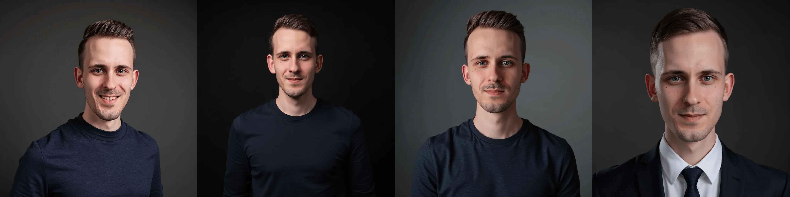
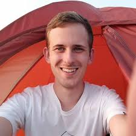

Profile pictures are oddly similar to CVs, you need them fairly infrequently and whenever you need them, they inevitably become outdated and require a bit of tweaking. For example, the profile picture I've been using for work and talks recently turned eight years old. Happy birthday!

Instead of going to the photographer, I wanted to take the data science approach and create new profile picture using [FLUX.1 dev](https://huggingface.co/black-forest-labs/FLUX.1-dev) with a [LoRA](https://arxiv.org/abs/2106.09685) adapter trained on my personal images. It seemed like a fun little project and won't break the bank. This article describes how you can do it too.

## Results

These are some of the *best* images, that I've generated. Subjectively, they look quite a lot like me, with a high resemblance to my training images.



## Methodology

Fine-tuning FLUX.1 is super easy with replicate. First, create an account at replicate.com and go to [ostris/flux-dev-lora-trainer](https://replicate.com/ostris/flux-dev-lora-trainer/train). Alternatively, you can use the even faster [fast-flux-trainer](https://replicate.com/replicate/fast-flux-trainer/train) at the cost of some flexibility.

We choose a name for our model and set it to private. Gather your input images for fine-tuning. Replicate recommends around 10 to 20 images with a resolution of 1024x1024.

I ended up with 19 images with mostly headshots, taken under different lighting conditions and from slightly different angles. While not strictly necessary, I scaled the images to the desired size using ImageMagick:

```sh
mkdir converted_images

for img in *.jpg; do
    mogrify -path converted_images -format jpg -resize "1024x1024>" "$img"
done
zip -r input_images.zip converted_images
```

You can provide custom descriptions for each image by saving `.txt` files named as the input image, but I found auto-generated captions using LLaVA 1.5 to be quite accurate.

| image | caption |
|-------|---------|
| | A photo of a young man wearing a white shirt and smiling under a red tent. The tent is orange and has a white roof. The man is standing in front of the tent and appears to be enjoying himself. The tent is set up outdoors and provides a comfortable shelter for the man and his companions.|

Next, we need to set a *unique* trigger word for the subject we want to generate (myself). I chose `BILZ` for mine. The trigger word is included in all image captions and helps the model to associate my profile and style learned from the training images with the keyword. So whenever we provide the trigger word to the model, the model will generate images in our style.

I increased the LoRA rank to 32 and left all other parameters like training steps at default. Now it's time to train the model, which only takes a few minutes.

Once training is finished, we can either prompt the model via web interface, HTTP or some APIs 🎉. As for designing a good prompt, I found blog posts at tensor.art helpful on [skin styles](https://tensor.art/articles/864585524067702268), [prompt weighting](https://tensor.art/articles/736115871065484219) and [lighting](https://tensor.art/articles/867587987527991248) helpful. Also browsing prompts for photo-realistic portraits at [civitai.com](https://civitai.com/images/), [reddit aiArt](https://www.reddit.com/r/aiArt/) or similar websites served as inspiration.

I ultimately used the following prompt, which you might want to adjust to your own needs:

```yaml
Photo of BILZ. masterpiece, best quality, ultra realistic (1.2), headshot of a man,
30 years old, professional clothing, studio lighting, dark background,
matte skin texture, different poses, computer scientist
```

I found that including the profession in the prompt had the greatest impact on achieving the more casual style I was after. Ultimately, I generated 30 to 50 images and selected the most realistic images. You might want to cross-check your images with community services like [photofeeler.com](https://www.photofeeler.com/) and don't forget to download the model weights and LoRA weights once you are ready.

## Final thoughts

Tinkering with FLUX.1 and LoRA is great fun for a rainy afternoon. The hurdle is very low with services like replicate and it only cost around 3 EUR. In the future I'd like to experiment with alternative models like [epiCRealism](https://www.seaart.ai/models/detail/9a0e9e0cc9a1ab753e356d4a3c51a76b). I can envision a future where we simply generate images for ourselves using our custom models for specific occasions (e.g., talks, our blog, etc.) based on a few reference images. However, in many cases it's difficult to overcome the [uncanny valley](https://de.wikipedia.org/wiki/Uncanny_Valley) or you might generate images of yourself that just don't quite look like you. Be responsible.
