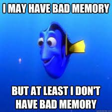

Training large language models (LLMs) on vast datasets is a double-edged sword. While we want them to learn general patterns, we must strictly avoid the verbatim memorization of sensitive data from the training corpus. A '24 NEURIPS paper titled "Be like a Goldfish, Don't Memorize!" (TODO: citation) introduces a surprisingly simple approach to address this issue: the *Goldfish Loss*.

The novel idea is to exclude specific tokens from the loss calculation during training, instead of incorporating all tokens up to the predicted one. This effectively forces the model to learn generalizable patterns instead of relying on rote memorization. Just like a goldfish with its famously short memory, this loss function forces the model to 'forget' specific tokens during training.[^1] Let's first understand why this matters.

## The Problem of Memorization

Memorization means that a generative model, like a LLM, fails to generalize and either copies or nearly replicates training samples in regions of the input space with poor coverage of training samples.[^2] Memorization in Large Language Models (LLMs) poses a severe risk to both LLM developers and data donors, whose data eventually end up in a training corpus. Such as:

*   **Copyright Risk for Providers/Customers:** If a model memorizes lyrics or books or copyrighted code, it can reproduce them verbatim, leading to uncertainties and potential lawsuits for those hosting the models and consuming the output. Recent practical examples include the lawsuit against Meta for training Llama 3 on Anna's Archive and LibGen [^3] or a lawsuit between German songwriter Helene Fischer (represented by GEMA) and OpenAI for memorizing the lyrics of "Atemlos durch die Nacht"[^4],[^5].
*   **Privacy Risks:** Memorization in LLMs can also lead to leakage of personal identifiable or sensitive information. Remember the early days, when you could trick ChatGPT to leak real email footers and other personal identifiable information (PII) because the model had memorized them from the training corpus? [^6]

No wonder, European regulators are increasingly focusing on measures to assess memorization. In my daily work at [Atruvia](https://atruvia.de/), I also have to assess the risk of memorization, conduct analysis and implement counter-measures for our own models. Let's see if the *goldfish loss* could come to our rescue.

## The Goldfish Loss

The authors propose *Goldfish Loss (GL)*, a modification to the standard training objective used in Causal Language Modelling (CLM).

### The Standard Causal Language Modelling Objective

Standard CLM trains the model to predict the next token $x_i$ given all previous tokens $x_{<i}$. Tokens are nowadays mostly sub-words e.g., the tokenizer of GPT-4 would split `Bilz` into `B`, `il`, `z`.[^7] The loss is calculated for *every* token in the sequence $x=\left\{x_i\right\}$ of $L$ training tokens, where $\theta$ represents the model parameters:

$$
\mathcal{L}(\theta)=-\frac{1}{L} \sum_{i=1}^L \log P\left(x_i \mid x_{<i} ; \theta\right).
$$

The objective is minimized if the model correctly predicts the entire sequence $\left\{x_i\right\}$ with high confidence. What you should remember: *all tokens* contribute to the final loss.

Here's a naive python implementation:
```python
# for original implementation see supplemental:
# https://proceedings.neurips.cc/paper_files/paper/2024/hash/2ad2dffba5079687651226ac8752df97-Abstract-Conference.html

import torch
import torch.nn.functional as F

def compute_clm_loss(logits: torch.tensor, tokens: torch.tensor) -> torch.tensor:
    """Compute standard CLM loss on all tokens.

    Args:
        logits (torch.tensor): Model predictions [batch_size, seq_len, vocab_size]
        tokens (torch.tensor): Target tokens [batch_size, seq_len]

    Returns:
        torch.tensor: loss.
    """
    # Shift: predict token i+1 from tokens 0..i
    shift_logits = logits[:, :-1, :].contiguous()
    shift_labels = tokens[:, 1:].contiguous()

    # Reshape for cross-entropy calculation
    loss = F.cross_entropy(
        shift_logits.view(-1, shift_logits.size(-1)),
        shift_labels.view(-1)
    )
    return loss
```

### The Goldfish loss

The *goldfish loss* modifies this by randomly masking a subset of tokens during the loss calculation to mitigate verbatim generation of memorized training samples. Specifically, it drops $1/k$ of the tokens.

$$
\mathcal{L}_{\text{goldfish}}(\theta)=-\frac{1}{|G|} \sum_{i=1}^L G_i \log P\left(x_i \mid x_{<i} ; \theta\right)
$$

where $G_i \in \{0, 1\}$ is a binary mask. If $G_i = 0$, the token is ignored in the loss and contributes otherwise.

By intuition, hyperparameter $k$ controls the aggressiveness of masking. For very large values of $k$, the goldfish loss approaches the standard CLM objective, since $\lim_{k \to \infty} \frac{1}{k} = 0$ means almost no tokens are masked. In the paper the authors set $k=4$, meaning 25% of all tokens are dropped.



As for $G$, the mask is *pseudo-random*, meaning that a passage is always masked *in the same manner*, unless the sequence is ever-so-slightly different (wait for the Section on limitations).[^9] We will discuss in the next section how to arrive at such a mask.

For now, I'd like to stress the following aspects:

1.  **Forward Pass:** The model still sees *all* tokens in the context. It's not masking like in BERT or tabular pre-training objectives, where the input is corrupted.[^8] The input remains intact!
2.  **Backward Pass:** The loss is only computed for the *unmasked tokens*. The model is never explicitly penalized for failing to predict the masked tokens, so it doesn't "learn" them as strongly. Critically, at *inference* time, the model must predict ALL tokens (including those that were masked during training). For identical sequences, the model must make an unsupervised guess for previously masked tokens, causing it to diverge from the training sequence and thereby impeding verbatim reproductions.

```python
# for original implementation see supplemental:
# https://proceedings.neurips.cc/paper_files/paper/2024/hash/2ad2dffba5079687651226ac8752df97-Abstract-Conference.html
import torch
import torch.nn.functional as F

def compute_goldfish_loss(logits: torch.tensor, tokens: torch.tensor, mask: torch.tensor) -> torch.tensor:
    """Compute Goldfish loss only on unmasked tokens.

    Args:
        logits (torch.tensor): Model predictions [batch_size, seq_len, vocab_size]
        tokens (torch.tensor): Target tokens [batch_size, seq_len]
        mask (torch.tensor): Binary mask [batch_size, seq_len] (1 = compute loss, 0 = skip)

    Returns:
        torch.tensor: loss.
    """
    # Shift: predict token i+1 from tokens 0..i
    shift_logits = logits[:, :-1, :].contiguous()
    shift_labels = tokens[:, 1:].contiguous()
    shift_mask = mask[:, 1:].contiguous()

    # Reshape for cross-entropy calculation
    loss = F.cross_entropy(
        shift_logits.view(-1, shift_logits.size(-1)),
        shift_labels.view(-1),
        reduction='none'  # Don't reduce yet
    )

    # Apply mask and compute mean only over unmasked positions
    mask_flat = shift_mask.view(-1)
    masked_loss = loss * mask_flat
    return masked_loss.sum() / mask_flat.sum()
```

### The Hashed Mask

Let's now focus on the token mask; the second
main contribution of the paper.

Recall that most language models are trained on the internet corpus and the internet is a fuzzy place[^10]. Texts may copied around the web, may be embedded into larger texts (buzzfeed in mean you) or restructured and data curation makes up for a large part of the effort spent on LLM training.

Ideally, we'd like to mask the same passages identically to prevent leakage.

Naive approaches, like masking every $k$-th character (referred in the paper as *static mask*) don't help here much, as the mask would aligned to the pre-training sequence and deviate if text was chunked differently or prefixed differently. Eventually, the model could see (and learn) every token. Feel free to experiment with the downsides of *static masking* in the interactive visualization.

Another layman's idea could be to mask purely randomly. If masks were purely random (referred to as *random mask* in the paper), however, the model could learn every token over the course of several epochs or from differently masked duplicates, impeding our original goal.

That's why, we need a mask, that is:

- deterministic
- independent from the absolute position of a sequence within longer sequence

Hence, the author's propose a *localized hashed mask*. The decision to mask a token $x_i$ is deterministic based on its immediate preceding context (the previous $h$ tokens) and the output hash function $\operatorname{hash}:|V|^h \rightarrow \mathbb{R}$. We mask $x_i$ if:
$$
\operatorname{hash}(x_{i-h}, \dots, x_{i-1}) <  \frac{1}{k} \implies \text{G}_i = 1
$$

Note, that with the context width $h$ we introduce another hyperparameter that needs to be set carefully. An example from the paper makes this very clear: If $h=7$ is used, the model may never learn to produce the word "Power" at the end of the phrase "the Los Angeles Department of Water and Power.". Definitely unsatisfying. Equally, $h$ should not be too large, as then the hash is underdetermined for the first $h-1$ tokens in the document. In the reference implementation the context widht defaults to $h=4$.

```yaml
TODO: comment on masking the beginning of sequences.
```

Now it's your turn to play. Adjust the slider below to see how the parameter $k$ affects which tokens are masked. Adjust the text and suffixes. You can also switch between *Static Mask* and the *Hashed Mask*. I'd also recommend to add vary punctuation to see how it affects masking.



Here's a simple python implementation. The authors reference implementation is slightly different as it uses a hash-table-based approach, which is both performant and mostly collision-free [^11].

```yaml
TODO: maybe adapt the implementation of the authors.
```

```python
import hashlib

import torch

def generate_hashed_mask(tokens, k, context_width=1):
    """Generate deterministic mask based on context hash.

    Args:
        tokens: List of token strings or token IDs
        k: Masking parameter (masks ~1/k of tokens)
        context_width: Number of preceding tokens to use for hash (h)

    Returns:
        Binary mask tensor [seq_len] where 1 = compute loss, 0 = skip
    """
    mask = []
    for i in range(len(tokens)):
        # Get context: previous h tokens (or "START" if at beginning)
        if i < context_width:
            context = "START"
        else:
            # Convert token IDs to strings if needed
            context_tokens = [str(t) for t in tokens[i-context_width:i]]
            context = " ".join(context_tokens)

        # Hash the context to get deterministic value
        hash_value = int(hashlib.md5(context.encode()).hexdigest(), 16)

        # Mask if hash % k == 0 (drops ~1/k tokens)
        mask.append(0 if hash_value % k == 0 else 1)

    return torch.tensor(mask, dtype=torch.float32)

# Example usage
tokens = ["The", "cat", "sat", "on", "the", "mat"]
mask = generate_hashed_mask(tokens, k=4, context_width=1)
print(mask)  # tensor([1., 0., 1., 1., 0., 1.]) (deterministic for this sequence)

# For batched inputs
def generate_hashed_mask_batch(token_ids, k, context_width=1):
    """Generate masks for a batch of sequences.

    Args:
        token_ids: Token IDs [batch_size, seq_len]
        k: Masking parameter
        context_width: Number of preceding tokens (h)

    Returns:
        Binary mask tensor [batch_size, seq_len]
    """
    batch_size, seq_len = token_ids.shape
    masks = []
    for b in range(batch_size):
        mask = generate_hashed_mask(token_ids[b].tolist(), k, context_width)
        masks.append(mask)
    return torch.stack(masks)
```


## Experiments & Results

The authors tested Goldfish Loss against standard training using **"Extractable Memorization"** (TODO: citation)  (defined as the ability to reproduce a training example given a prefix).

### Extreme Setup
They trained a LLaMA-2-7B model for **100 epochs** on a small set of Wikipedia articles—a recipe for disaster (memorization).
*   **Standard Training:** Memorized 84/100 articles verbatim.
*   **Goldfish Loss ($k=4$):** **Zero** verbatim memorization.

### Standard Setup
On a more realistic setup (TinyLLaMA-1.1B, single epoch), Goldfish Loss still significantly reduced the model's ability to reproduce training sequences compared to standard CLM.

NOTE: It would have been interesting to see how the standard CLM model with different temperatures would have compared against the goldfish models.

> [!NOTE]
> **Dropout vs. Goldfish Loss**: While both are regularization techniques, they differ fundamentally. **Dropout** randomly disables neurons (architecture) to prevent feature co-adaptation. **Goldfish Loss** disables loss computation for specific data points (objective) to prevent verbatim recall.

## Limitations

There are some caveats though:

1.  **Training Efficiency:** Since in a setup with goldfish loss, we are ignoring $1/k$ of the training tokens, the model learns "slower" per batch. You effectively need to train on more data (or for longer) to reach the same validation loss as a standard model. The authors, however demonstrate (rather convincingly) on the RedPajamaV2 dataset, that if we compare the validation loss for the supervised tokens (aka unmasked) tokens with an equal number of input tokens in a standard training setup, both models end up with an approximately an equal validation loss (see Fig. 5 in paper).
2.  **Near-Duplicates:** The approach is still prone to near-duplicates. You can spot this in the interactive visualization above easily. E.g., small rewrites or some added punctuation or different different unicode-encoding, the hashed mask might be different for each version, allowing the model to piece together the full text from the different copies. (see Sec. 6.3 in paper)

## Conclusion

Goldfish loss is a clever, lightweight adaption of the CLM that can be easily dropped into existing training recipes. This is a big plus for practitioners with limited resources.

It offers a promising alternative for training powerful models that respect privacy-by-design, rather than relying on complex machine unlearning strategies. I agree with the authors, that its most It's most useful on high-risk sources or late phases of training e.g., fine-tuning.

Practically, the positive effects from the *goldfish loss* will only as good as the engineering that went into filtering and removal of near-duplicates of the training corpus. Common practice of training on rewritten synthetic texts or near-identical synthetic texts based on real seeds need to be rethought, as both would impede consistent masking. [^13]

Lastly, I remain slightly skeptical about their copyright compliance angle:

> We hope that goldfish loss paves the way for aiding copyright compliance rather than serving as a means to misuse private data maliciously. (Sec. 7)

While their loss function prevents *verbatim* reproduction, the model still learns the *information* and *style* from the copyrighted works. Is a paraphrased text more copyrighted-compliant? That's a question for the courts, not the loss function.

## References

[^1]: More than allegedly. As a child, I used to have a small goldfish living in a large bowl.
[^2]: While conceptually similar to overfitting, an overfitted model would fit the training distribution too precisely including noise and idiosyncrasies and perform poorly on the true underlying distribution.
[^3]: [This article](https://www.theatlantic.com/technology/archive/2025/03/libgen-meta-openai/682093/) by *the Atlantic* gives a good overview incl. [a search tool](https://www.theatlantic.com/technology/archive/2025/03/search-libgen-data-set/682094/).
[^4]: More details can be found [here](https://www.gesetze-bayern.de/Content/Document/Y-300-Z-GRURRS-B-2025-N-30204?hl=true).
[^5]: Haters would say, that reproducing the lyrics verbatim isn't too hard.
[^6]: Read [this article](https://www.zdnet.com/article/chatgpt-can-leak-source-data-violate-privacy-says-googles-deepmind/) for some background information on the attack vector.
[^7]: You can play around with different tokenizers on [tiktokenizer.vercel.app](https://tiktokenizer.vercel.app/?model=gpt-4). It's also a nifty tool, if your models need to run on a tight budget.
[^8]: see e.g., the [FT-Transformer paper](https://arxiv.org/pdf/2106.11959)
[^9]: In this context, pseudo-random doesn't refer to pseudo-random number generators, which are the most common variant in modern computers, but rather to the fact, that masking of tokens is done randomly and identical sequences will be masked identically. If you are interested in true random number generators, you can read [this article](https://blog.cloudflare.com/lavarand-in-production-the-nitty-gritty-technical-details/) on a creative approach to generate truly random numbers using lava lamps at cloudflare.
[^10]: For some interesting infographics see this [nature article](https://www.nature.com/articles/d41586-024-03990-2)
[^11]: For original source code see [here.](https://proceedings.neurips.cc/paper_files/paper/2024/hash/2ad2dffba5079687651226ac8752df97-Abstract-Conference.html)
[^13]: See e.g, the [technical report of Phi-4](https://arxiv.org/pdf/2412.08905)
