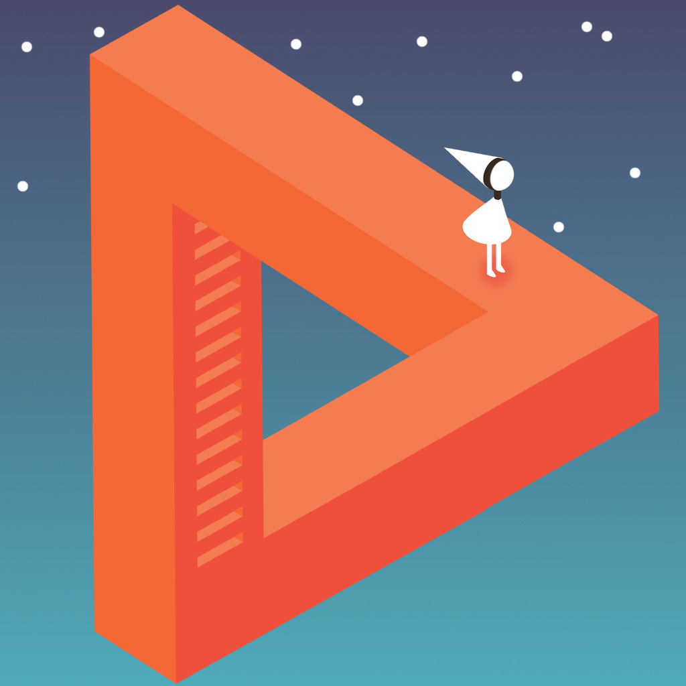
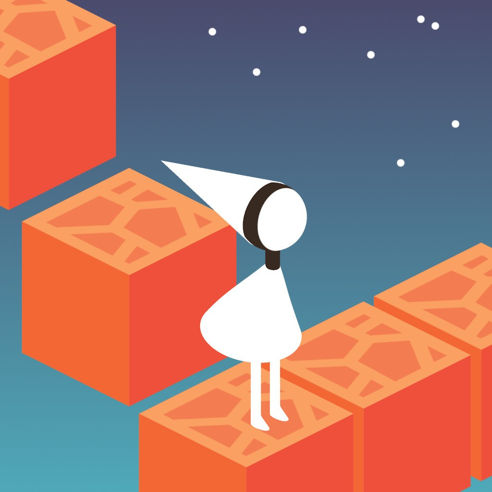
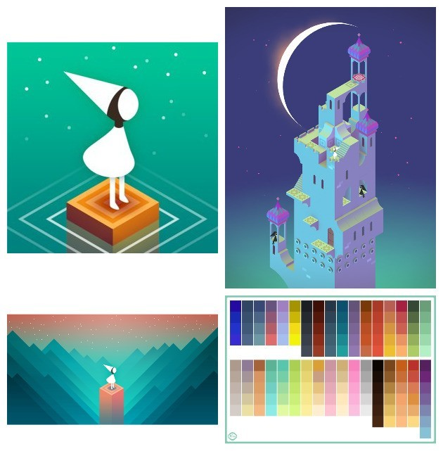
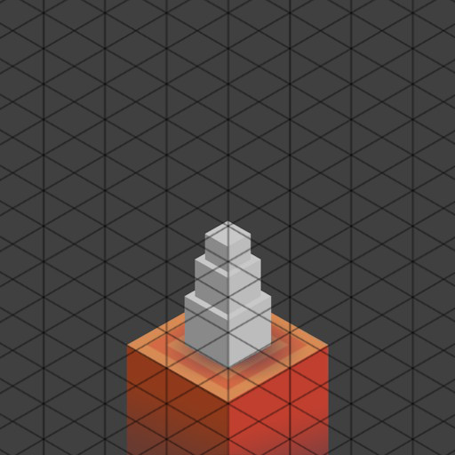
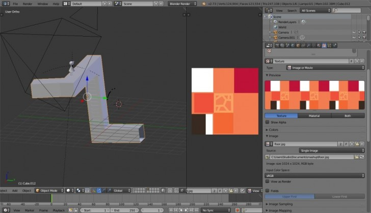
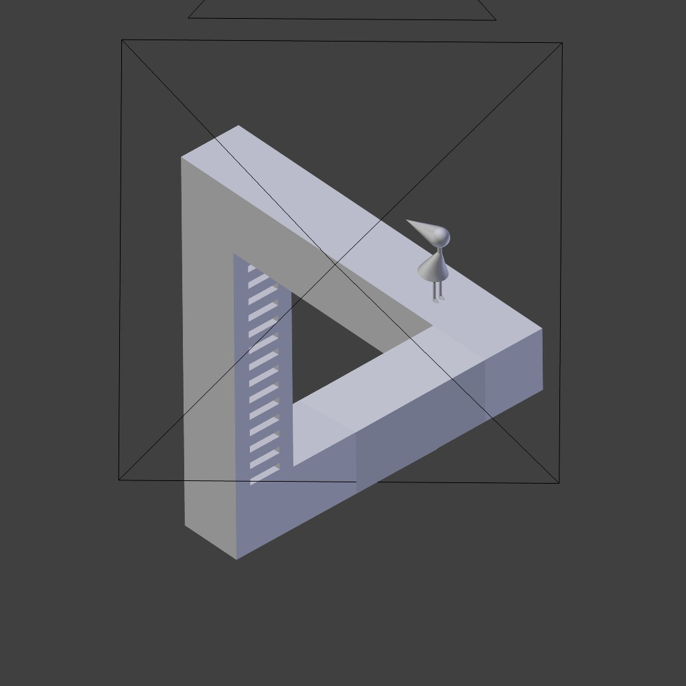

While doing my attractors project, I accidentally came across the drawings by [M.C. Escher](http://www.mcescher.com/). I have seen some of his drawings earlier at a friend’s house, but didn’t realize that they were actually created by him. I stuck with the idea of creating impossible objects in Blender by myself but couldn’t think of a proper scene setup.

Several years ago I heard about a game called [“Monument Valley”](https://play.google.com/store/apps/details?id=com.ustwo.monumentvalley&hl=en) (by ustwo). I recently came across this app again, when surfing the Amazon store. This was like an aha moment. I decided to combine the simple but marvellous character Ida and the color palette with my own [penrose triangle](https://en.wikipedia.org/wiki/Impossible_object).

I had some spare time today, so I attempted combining both. If you want to create your own images, feel free to download the source files [here](https://drive.google.com/file/d/0Bw-DRf6BLrXMM3R4ZlZxSjJZMkU/view?usp=drive_link&resourcekey=0-Btd8pRBmL9llLuDDtQ_FPA). This is what I came up with:

## Making of

I began my project by searching the web for some graphics related to monument valley, which served as a reference.

## Getting the “view” right

The special thing about this project is the use of [isometric projection](https://en.wikipedia.org/wiki/Isometric_projection). This technique is commonly used in computer games. This technique was also used in the original “monument valley app”. The special thing about it is you use an orthographic camera positioned at a certain angle (e.g. 54,726°/0°/45°). This will give you the “illusion” of perspective. My final angle did differ slightly, as I didn’t want to break the illusion of the Penrose triangle.

Modeling itself was really simple and was done within minutes. The main character is made of an UV-Sphere and several cylinders. I’ve eyeballed everything until I reached a level of detail that I’ve liked.

The “cone” acting as the hat, is also modeled from a cylinder. I had to fake the illusion due to some shading issues with the Catmull-Clark modifier applied to the mesh. I used flat shading for the penrose triangle and smooth shading for the character. But as I’ve switched to shadeless materials later, this fact didn’t really matter.

Fun fact: The 3d models of “MV” are at least partly created with Blender (see video).



## Texturing

All the models are unwrapped. I combined the textures and colours in one large sprite sheet, because I didn’t want to create several materials with nearly the same settings. The textures were created with GIMP, just as usual. I’ve sampled the base colour from an image, the other colors were added as needed. As I’ve used shadeless materials I was forced to set up some brighter and some darker colors to fake shadow and light. Unwrapping my mesh using the standard projection or the “project from view” option allowed me to quickly texture my mesh.

## Lighting

I didn’t use a single light in my scene.

## Rendering/ Post-Pro

It’s been a while since I’ve last used BI. But for this project it was the perfect choice, as I didn’t need photorealistic lighting nor physically based shading. The whole image was rendered within seconds.

In Gimp, I finally created the background with the gradient and the stars and composed the image. Et voila!

Comments and critique welcome.

EDIT: This article was also featured on [Blender Nation](https://www.blendernation.com/2015/02/09/behind-the-scenes-isometric-illusion/) ✨.
